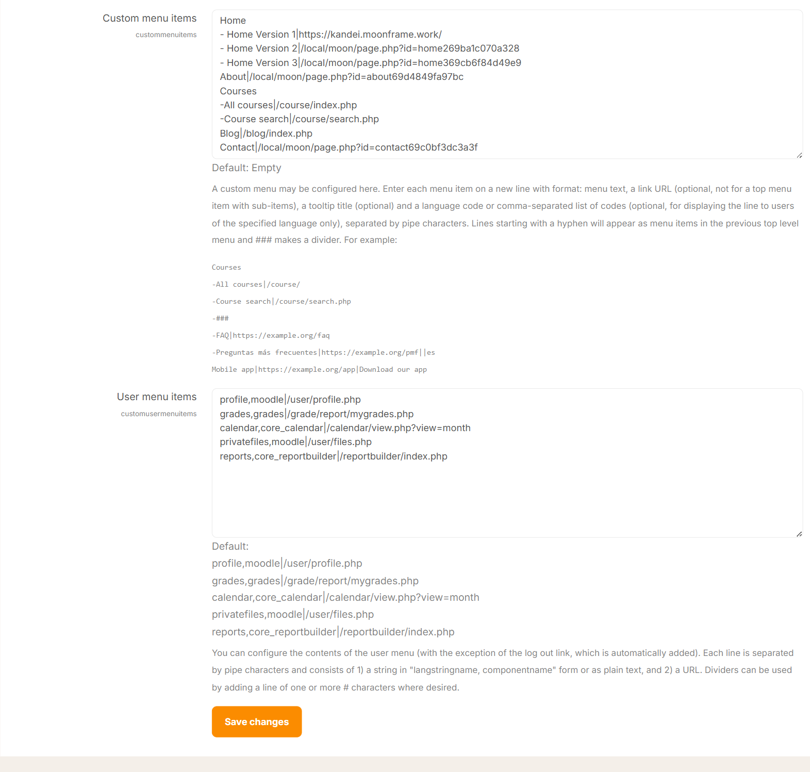

# Custom Menu

Setting up your custom menu is very simple and uses a straight forward syntax that anyone can use. Read more at [Moodle Custom Menu](https://docs.moodle.org/33/en/Theme_settings#Custom_menu_items).



---

# 📘 How to Add a Custom Menu in your Moodle

## Step 1: Go to Theme Settings

1. Log in as an **Administrator**
2. Navigate to: **Site administration → Appearance → Advanced Theme settings**
3. Find the **Custom menu items** field

---

## Step 2: Add Menu Items

Essentially, every menu item consists of 2 parts: the menu title as text (which is what users will see) a vertical bar and then the link url. 
The vertical bar or pipe is used whenever the menu item will be linked. For sub-menu items (those that show when you click or hover over the menu titles) you can add a prefix of one dash or two dashes depending on the hierarchy.

Enter each menu item on a **new line** using this format:

```
Menu text | URL
```

### Example:

```
Home | /
Courses | /course/index.php
Contact | /contact
```

---

## Step 3: Create Dropdown Menus

To create a submenu, use a **hyphen (-)** before items:

```
Courses
- All courses | /course/index.php
- Search courses | /course/search.php
```

👉 “Courses” becomes a parent menu with dropdown items.

---

## Step 4: Add Divider (Optional)

Use `###` to insert a separator:

```
Resources
- Docs | /docs
- ###
- Support | /support
```

---

## Step 5: Multi-language Menu (Optional)

```
Home | / | en
Trang chủ | / | vi
```

---

## ⚠️ Tips

* No spaces around `|`
* Use relative URLs (e.g. `/course/index.php`)
* Make sure your theme supports custom menus
* Use `-` correctly for dropdowns


