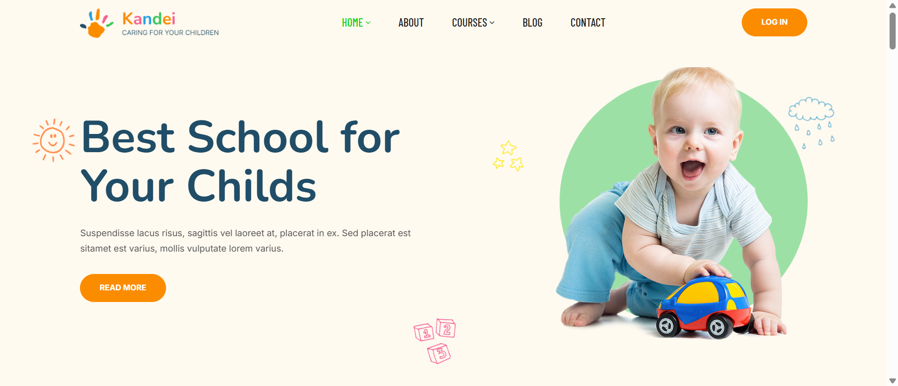

# Kandei - Introduction

Kandei is a vibrant and powerful Moodle theme crafted to bring educational websites to life. Designed especially for kindergartens, preschools, childcare centers, schools, and online learning platforms, it blends playful design with professional performance to create an engaging learning environment.

Packed with rich features and intuitive customization options, Kandei makes it effortless to build a stunning education website without complexity. Easily personalize layouts, colors, fonts, banners, and powerful admin controls give you complete flexibility across every page.

With its fully responsive design, Kandei delivers a seamless experience on any device, ensuring your content looks perfect whether viewed on desktop, tablet, or mobile.

Kandei is everything you need to build a modern, impactful eLearning website.

## Extended Features – Kandei Kindergarten & Preschool Moodle Theme

### Design & User Experience

* Bright, playful, and child-friendly design concept
* Carefully crafted UI focused on early education environments
* Clean layout with engaging visuals for better user interaction
* Smooth navigation optimized for parents, teachers, and students
* Retina-ready display for sharp and vibrant graphics

### Fully Responsive & Mobile Optimized

* 100% responsive design across all devices
* Optimized for mobile, tablet, and desktop experiences
* Touch-friendly elements for easy interaction on smart devices
* Consistent layout and performance on all screen sizes

### Powerful Theme Options Panel

* Advanced admin panel for full site control
* Real-time customization without coding knowledge
* Global settings for layout, colors, and typography
* Easy configuration for headers, footers, and content sections

### Flexible Layout System

* Multiple pre-designed page layouts
* Customizable homepage sections
* Flexible sidebar and content positioning

### Customization & Branding

* Unlimited color options to match your brand identity
* Google Fonts integration for typography control
* Logo, favicon, and branding customization
* Custom CSS support for advanced styling

### Media & Visual Elements

* Banner and slider support for featured content
* Image-rich sections for showcasing activities and programs
* Gallery-ready layouts for events and classrooms
* Icon integration for better visual communication

### Education-Focused Features

* Designed specifically for kindergarten & preschool websites
* Ideal for schools, daycare centers, and early learning platforms
* Seamless integration with Moodle LMS core features
* Structured layouts for courses, announcements, and activities

### Performance & Optimization

* Lightweight and optimized for fast loading speed
* Clean and well-structured codebase
* SEO-friendly structure to improve visibility
* Optimized assets for better performance

### Compatibility & Integration

* Cross-browser compatibility (Chrome, Firefox, Safari, Edge)
* Compatible with latest Moodle versions
* Supports standard Moodle plugins and extensions
* RTL (Right-to-Left) language support

### Reliability & Usability

* Regular updates and improvements
* Stable and secure framework
* Easy installation and setup process
* Well-documented for quick onboarding

### Developer Friendly

* Clean, modular code structure
* Easy to extend and customize
* Custom CSS/JS support

