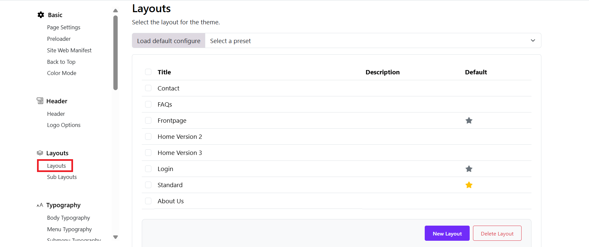

# Page Layouts

## Overview

The Layout Builder allows administrators to visually create and manage page structures by arranging:

- Layouts (Home, Testimonials, About, Login, etc.)
- Sections
- Rows (Columns)
- Elements / Blocks (Heading, Text, Image, Grid, Button, Slider, etc.)

You can build complex pages without coding by adding and organizing these components.

---

## Page layout builder

When you come with pages such as: Home pages, About, Contact, Testimonials > Login, and FAQs, please heading to
- Log in to the Admin Dashboard > Site Administration > Appearance > Themes 
- Edit Kandei theme's settings > Layouts
- Select the layout you want to edit (e.g., About).
- Click to open the layout builder interface.

You can find all the prebuilt layouts available, if you want to create a new layout, just click on the "New Layout" button at the bottom. 
Besides, you can also delete any necessary layout. 

### 1. Layout Tabs

You can manage multiple layouts using tabs by switching between layouts by clicking the tab, or create a new layout.

- Edit the layout title: Click on the Edit info button in the bottom bar
- Default layout: You can set a layout as default by clicking on "Mark As Default" button 

### 2. Understanding the Structure

The Layout Builder works in three levels:

Layout
└── Section
└── Row (Column structure)
└── Elements (Content Blocks)

### 3. Managing Sections

#### 3.1 Add a New Section

Click + New Section inside the layout.

Choose column structure (e.g., col-lg-12, col-lg-6, etc.).

#### 3.2 Section Controls

Each section includes action icons:

✏ Edit section settings

📋 Duplicate section

🗑 Delete section

🔼 Move section

➕ Add new row

#### 3.3 Reordering Sections

Drag and drop sections vertically to change position.

### 4. Managing Rows & Columns

Within each section: You can define column width (e.g., 12, 6-6, 4-4-4). Add multiple rows inside a section and adjust column layout for responsive design.

### 5. Adding Elements (Blocks)

Inside each row, you can add content elements such as:

- Heading
- Text
- Image
- Grid
- Button
- Slider
- Testimonials
- Video Button
- Blocks
- Main Content
- Menu Backend
- Course Category Tab

#### 5.1 Add an Element

- Click the + icon inside a column.
- Select the desired element.
- Configure its settings.
- Click Save.

#### 5.2 Edit an Element

- Click the element block.
- Modify content, styling, or settings.
- Save changes.

#### 5.3 Duplicate or Delete

Use action icons to duplicate or remove elements.

### 6. Special Sections 

6.1 Header Section: the header section controls Logo, Navigation, Menu backend, Top bar
6.2 Main Content: Displays dynamic page content (e.g., course listings, blog posts).

>>Important: Removing Main Content may prevent the page from displaying its core content.

6.3 Footer Section: Usually built as a Sub-layout and inserted into the page layout.

