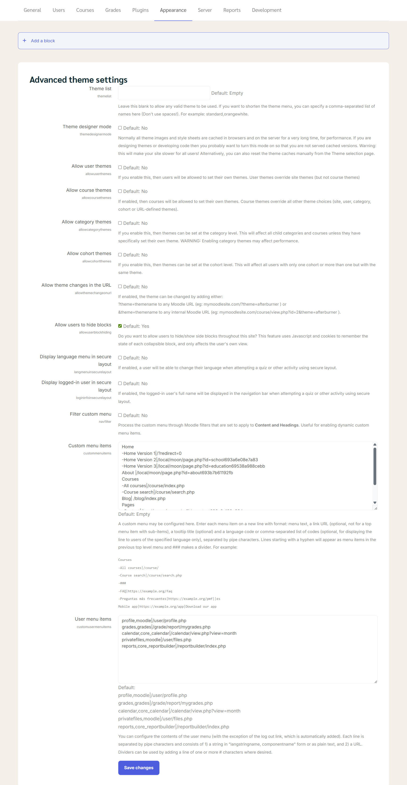

# Advanced Theme Settings

This page controls **how themes work and how much users can customize the look of Moodle**. Most sites only need a few options enabled.




---

## 1. Theme list

**What it does:**
Limits which themes appear in the theme selection menu.

**How to use:**

* Leave **empty** → All installed themes are available (recommended).
* Enter theme names separated by commas (no spaces) → Only those themes appear
  Example:

  ```
  boost,classic
  ```

**When to use:**
If you want to **restrict admins or users to specific themes**.

---

## 2. Theme designer mode

**What it does:**
Disables caching so design changes appear immediately.

**Recommended setting:** ❌ **No**

**Turn ON only when:**

* You are **developing or testing a theme**
* You need to see CSS/image changes instantly

⚠️ Warning: This **slows down the site for everyone**.

---

## 3. Allow user themes

**What it does:**
Lets users choose their **own theme**.

**Recommended setting:** ❌ **No**

**Enable only if:**

* You want users to personalize their Moodle appearance

📌 User themes override the **site theme**, but not course themes.

---

## 4. Allow course themes

**What it does:**
Allows each course to have a **different theme**.

**Recommended setting:** ❌ **No**

**Enable only if:**

* Different courses need **very different layouts or branding**

⚠️ Course themes override **all other theme settings**.

---

## 5. Allow category themes

**What it does:**
Allows themes to be set at the **course category** level.

**Recommended setting:** ❌ **No**

⚠️ Warning:
Can **reduce performance** and make appearance harder to manage.

---

## 6. Allow cohort themes

**What it does:**
Assigns themes based on **user groups (cohorts)**.

**Recommended setting:** ❌ **No**

**Advanced use only**, usually not needed for most sites.

---

## 7. Allow theme changes in the URL

**What it does:**
Allows changing the theme by adding it to the website link.

**Example:**

```
?theme=boost
```

**Recommended setting:** ❌ **No**

**Why disable it:**

* Prevents confusion
* Avoids inconsistent appearance

---

## 8. Allow users to hide blocks

**What it does:**
Lets users **hide or show side blocks** (navigation, calendar, etc.).

**Recommended setting:** ✅ **Yes**

**Notes:**

* Only affects the **user’s own view**
* Uses cookies to remember preferences

👍 This improves usability without risk.

---

## 9. Display language menu in secure layout

**What it does:**
Shows language selector on secure pages (e.g. quizzes).

**Recommended setting:** ❌ **No**

Enable only if users need to change language during quizzes.

---

## 10. Display logged-in user in secure layout

**What it does:**
Shows the user’s **full name** in secure pages.

**Recommended setting:** ❌ **No**

Mostly optional, cosmetic only.

---

## 11. Filter custom menu

**What it does:**
Applies Moodle text filters to the custom menu.

**Recommended setting:** ❌ **No**

Enable only if:

* You use **dynamic content** or filters in menu text

---

## 12. Custom menu items

**What it does:**
Creates **custom links** in the top navigation menu.

**How it works:**

* One menu item per line
* Use `-` for sub-items
* Use `###` for a divider

**Example:**

```
Home
-Courses
--All courses|/course/index.php
--Course search|/course/search.php
###
Blog|/blog/index.php
```

**When to use:**
To add **quick links** to important pages.

---

## 13. User menu items

**What it does:**
Controls links in the **user profile dropdown menu**.

**Default items include:**

* Profile
* Grades
* Calendar
* Private files
* Reports

**Recommended:**
Leave default unless you want to **simplify or customize** the menu.

---


