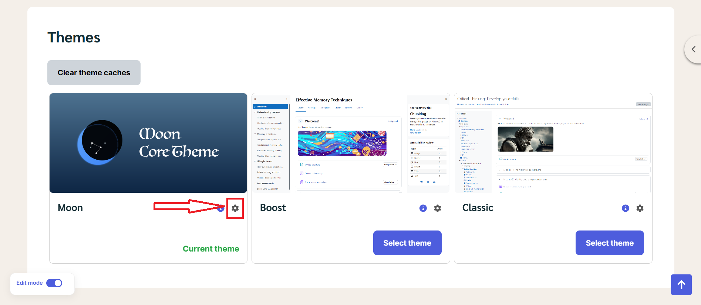

# Theme Footer

Please go to Site Administrator > Appearance > Themes > Edit the Moon theme's settings > Layout > Sub-Layout.

---

# Theme Footer – Admin Manual

## 1. Overview

The **theme footer** is created using a **Sub-Layout**.
This sub-layout is then inserted into the **Main Layout**, allowing you to reuse and manage the footer content easily.

You can:

* Edit footer content (text, links, images, phone number)
* Adjust column widths
* Add or remove footer sections
* Control how the footer appears on desktop, tablet, and mobile

---

## 2. Accessing the Footer Sub-Layout

1. Go to **Theme Settings** or **Layout Builder**
2. Open **Sub Layouts**
3. Select the footer sub-layout (example: *Footer Layout*)
4. Click **Edit**

You will now see the footer layout editor.

---

## 3. Understanding the Footer Structure

### 3.1 Sections

The footer is divided into **sections** (labeled as *Astroid Section*).

Each section can contain:

* One or more rows
* Multiple content blocks (text, image, links, etc.)

You can:

* ✏ Edit a section
* 🗑 Delete a section
* ➕ Add a new section

---

### 3.2 Rows and Columns

Inside each section:

* Content is arranged in **columns**
* Column width is controlled by dropdowns like `col-lg-2`, `col-lg-4`, `col-lg-6`

**Example:**

* `col-lg-2` = small column
* `col-lg-4` = medium column
* `col-lg-6` = half width

👉 Column sizes affect **desktop view**. Tablet and mobile views auto-adjust.

---

## 4. Footer Content Blocks

Each box inside a column is a **content block**.

### Common footer blocks include:

* **About Us** – Text description
* **Links** – Menu or quick links
* **Support** – Help or contact info
* **Follow Us** – Social media links
* **Image** – Logo or footer image
* **Phone Number** – Contact phone
* **Text** – Custom text content

---

## 5. Editing Footer Content

1. Click on a content block (e.g. *About Us*)
2. Update the text, image, or links
3. Click **Save** when finished

Changes apply instantly after saving.

---

## 6. Adding New Content

### Add a new content block

* Click the **➕ (Plus)** icon inside a column
* Choose the content type (Text, Image, Links, etc.)

### Add a new row

* Click **+ New Row**

### Add a new section

* Click **+ New Section**

---

## 7. Device Preview

At the top of the editor, you can switch between:

* 🖥 Desktop
* 💻 Laptop
* 📱 Tablet
* 📱 Mobile

Use these to ensure the footer looks good on all devices.

---

## 8. Saving Your Changes

At the bottom of the screen:

* **Save** – Save changes and continue editing
* **Save & Close** – Save and exit
* **Cancel** – Discard changes

⚠️ Always click **Save** before leaving the page.

---

## 9. How the Footer Appears on the Website

* The footer **sub-layout** is linked to the **main layout**
* Any changes you make here will automatically update the website footer
* No additional setup is required

---

