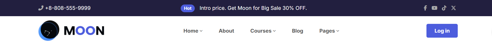
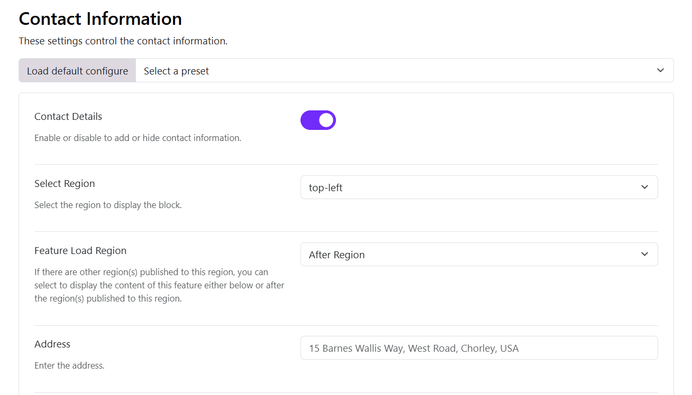
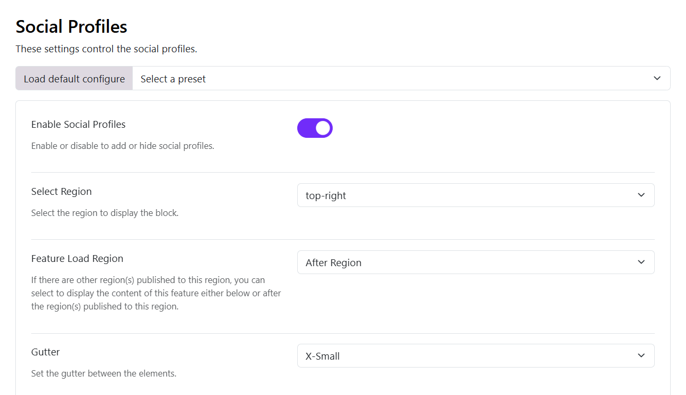
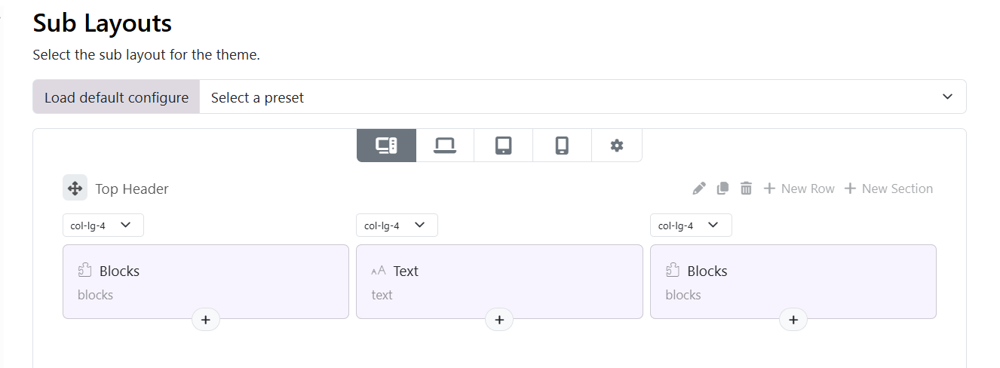
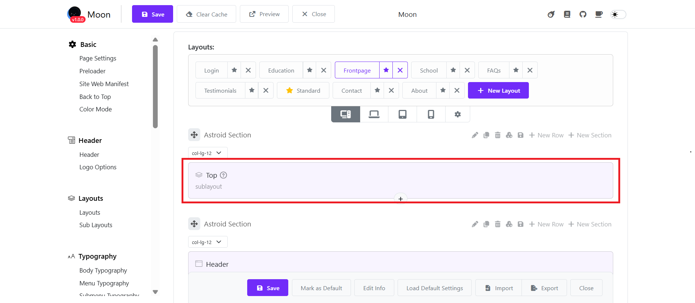

# Header Settings

## 1. Accessing Header Settings

1. Log in to the Admin Panel.
2. Open **Moon → Theme Settings**.
3. Go to **Header** in the left sidebar.
4. Click **Save** after making changes.

Use **Preview** to check the result before publishing.

## Enable Header

**Enable Header** (Toggle)

* **On**: Header is visible on the website.
* **Off**: Header is completely hidden.

> Tip: Turn this off if you want a landing page without a header.

## Header Modes

The Moon Header System supports three primary modes, each with its own layout options and configuration parameters.

To select a header mode, follow these steps:
1. Go to Site Administrator > Appearance > Themes > Theme Settings (Current theme) > Header > Header
2. Select a **Header Mode** option.
3. Save your changes.

### Horizontal Header

The horizontal header layout arranges elements in a row across the page. It offers three different menu placement options: left, center, and right.

* **Left**: The logo and the menu items are positioned to the left and the header block is to the right
* **Center**: Here the logo is to the left, menu items are in the center and the header block is on the right
* **Right**: Here the logo is to the left, the menu items and header block are to the right

### Stacked Header

The stacked header provides more complex layouts with elements stacked in multiple rows. It supports five layout variants:

* **Center Balance** - Logo centered between left and right sections
* **Center** - Logo and menu centered
* **Separated** - Logo with menu items separated evenly
* **Divided** - Logo on left, menu below
* **Divided** Logo Left - Logo on left in a fixed width column with menu and other elements in adjacent columns

### Sidebar Header

The sidebar header positions elements in a vertical column on the side of the page. It offers three placement options:

* **Left** - Vertical header on the left side
* **Right** - Vertical header on the right side
* **Topbar** - Combination of horizontal topbar with vertical sidebar

### Header Blocks
Choose what you want to display in the header blocks from the given options in the dropdown that is:

* **Blank**: Leave a blank space
* **Region**: Publish a module whose position you can choose in the next option Block Position
* **Custom HTML**: You can also publish a custom HTML in the header block, simply writing your code in the next option Block 1 Custom HTML

:::info[Note]
Some Header Blocks will only work on desktops, not for tablets and mobile.
:::

### Header Breakpoint

Controls **when the header changes layout on smaller screens**.

Available breakpoints:

* Large
* Medium
* Small

Example:

* **Large**: Header switches to mobile layout earlier (on tablets).
* **Small**: Header stays desktop-style longer.

> Recommended setting: **Large** for better mobile usability.

## Common Issues & Solutions

**Header not visible**: Check that **Enable Header** is turned on.

**Menu not aligned correctly**: Verify **Header Mode** and **Horizontal Menu Mode**.

**Changes not showing**: Click **Clear Cache**, then refresh the page.

# Header TopBar

## Assign Contact Info and Social Profile to a position

* You should go to Theme settings > Edit a page (ex: Frontpage) > Contact Information > Enable the contact details, then add your contact info such as: phone number, address, email, open hours ...
* Select a region to display the block (choose Top-left)

* Then go to Social Profile > Enable Social Profile > Select a region to display the block (Choose top-right)

## Create a sub-layout for the top-bar

Go to Layout > Sub layouts > Create a sub layout > Add blocks and elements to fit your need. 
With each block, you should select a corresponding region that is assigned to the contact info and social profile before. 

After that edit your main layout > add the sub-layout to the main layout. 

