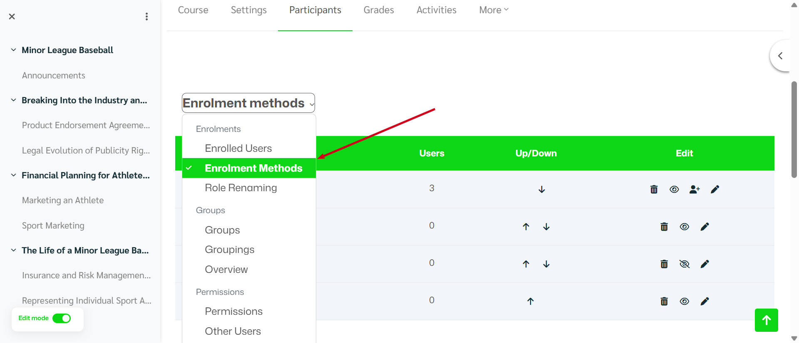

# Course Enrolment

## Overview

Course enrolment in Moodle allows teachers or administrators to control **how users join a course**. Enrolment can be done manually, automatically, or through other methods depending on the course configuration.

To manage enrolment settings, navigate to:

**Courses → Edit a course > Participants → Enrolment methods**

This page displays all enrolment methods currently enabled for the course.

---

## Accessing the Enrolment Methods Page

1. Open the course.
2. Click **Participants** in the course navigation menu.
3. From the dropdown menu, select **Enrolment methods**.

You will see a list of enrolment methods available for the course.

### Available Actions

Icons in the **Edit** column usually allow you to:

* 👁 **Enable/Disable** the enrolment method
* 👤➕ **Enrol users manually**
* ✏️ **Edit settings**
* 🗑 **Delete the enrolment method**

---

# Common Enrolment Methods

## 1. Manual Enrolment

Manual enrolment allows teachers or administrators to add users individually.

### How to Enrol a User Manually

1. Go to **Participants → Enrolment methods**
2. Locate **Manual enrolments**
3. Click the **Enrol users icon (👤➕)**
4. Search for a user
5. Select a **Role** (Student, Teacher, etc.)
6. Click **Enrol users**

The selected user will immediately gain access to the course.

---

## 2. Self Enrolment

Self enrolment allows users to enrol themselves into a course.

### How It Works

* Users can join the course themselves
* An **enrolment key (password)** may be required
* The teacher controls availability

### Configuring Self Enrolment

1. Go to **Participants → Enrolment methods**
2. Click **Edit (✏️)** next to **Self enrolment**
3. Configure settings such as:

    * **Enrolment key**
    * **Maximum enrolled users**
    * **Start and end date**
    * **Default assigned role**

Click **Save changes** when finished.

---

## 3. Guest Access

Guest access allows visitors to view course content without enrolling.

Features:

* Users do not appear in the participant list
* Guests typically cannot submit activities or assignments

---

## 4. Cohort Synchronisation (Optional)

Administrators can enrol **entire groups of users** automatically using cohorts.

This is useful when:

* A group of students needs access to multiple courses
* Enrolment is managed at the **site level**

---

# Managing Enrolment Methods

## Change Enrolment Order

Use the **Up/Down arrows** to reorder enrolment methods.

This affects which method is used first if multiple enrolment options exist.

---

## Disable an Enrolment Method

To temporarily stop new enrolments:

1. Click the **eye icon (👁)** to disable the method.
2. The method becomes inactive but existing users remain enrolled.

---

## Delete an Enrolment Method

To remove an enrolment method completely:

1. Click the **trash icon (🗑)**
2. Confirm the deletion.

⚠️ Deleting an enrolment method may remove users enrolled through it.
