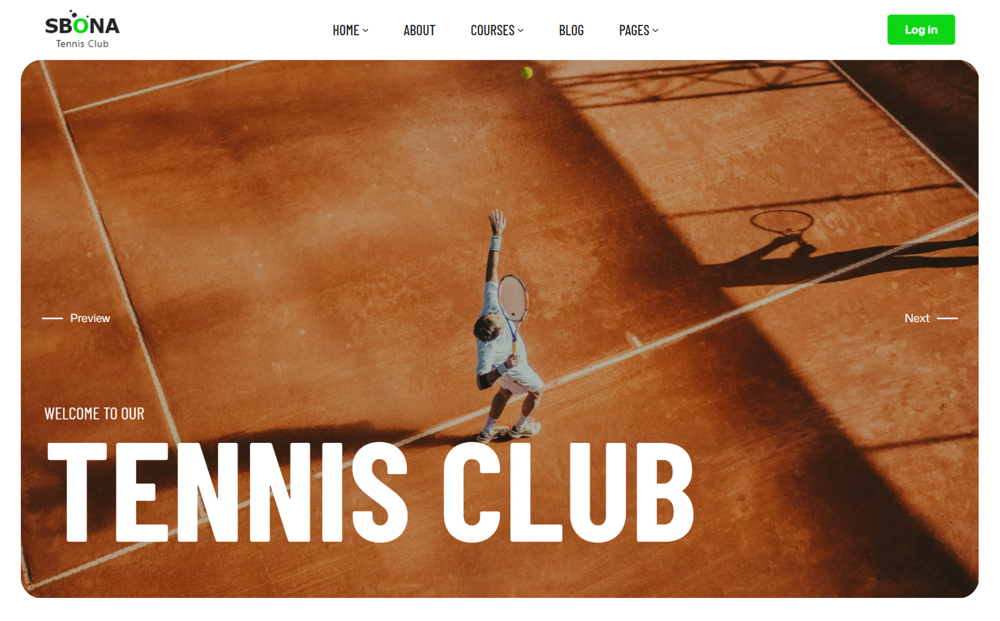

# Sbona - Introduction

Sbona is a modern and powerful Moodle LMS education theme designed for universities, schools, and online academies that need a fast setup, clean course layouts, and full Moodle compatibility. This Moodle education theme is 100% responsive, clean, and fluid, delivering a sharp and consistent user experience on all devices. 
Moon includes multiple flexible and customizable front-page sections, all easily managed through the admin settings panel. With its modern design, LMS-focused features, and easy customization, Moon is the perfect solution for anyone looking to build a high-quality Moodle LMS education website without coding.

The theme comes packed with powerful customization options and is continuously updated with new features, improvements, and Moodle LMS compatibility to keep your education website modern and future-ready.

## Theme's Feature Overview

- Layout Builder: Easily set up and customize layouts for every page.
- Header Options: Create the perfect header for your site and add a flexible top bar.
- Footer Layout Builder: Change the footer columns with layout builder and elements text, heading, social…
- Moodle Blocks: Multiple block positions and styles allow you to enhance your core course content.
- Unlimited Colors: The theme options make it easy for you to customize the style of your Moodle site.
- Font Selector: Select different fonts for body text and heading from the Google font Collection
- Multilanguage Support: Theme Moon provides support for multilingual websites in LTR and RTL languages.
- Regular updates: Theme Moon is the longest standing premium Moodle theme.
- Custom Enrolment Page: Create attractive pages where users can subscribe to a course.
- Site News: Show your site news with an attractive blog-style layout.
- Course Overview: Choose between different styles and options to promote your courses.
- Responsive Design: Sbona theme adapts to all screen resolutions. It’s 100% responsive and looks great on all devices.
