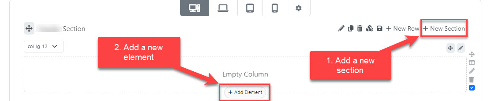
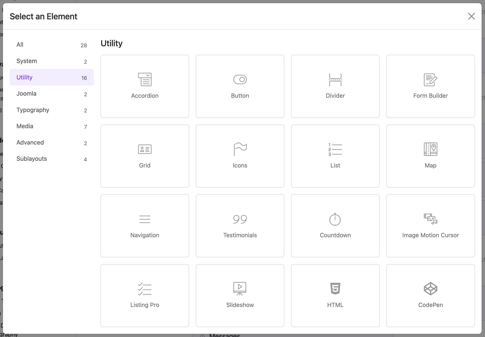

# RawHTML

The **RawHTML Widget** in Astroid allows you to insert custom HTML code directly into your Joomla pages. This is useful for embedding custom elements, third-party scripts (like widgets or iframes), or advanced layout tweaks.

---

## 📌 What is RawHTML Widget?

This widget is used to inject raw HTML into your layout without the editor filtering or modifying it. Ideal for developers and advanced users who want full control over their markup.

---

## ⚙️ How to Use

### Step 1: Add the Widget
- Open your Astroid layout editor.
- Click on **Add Widget**.
- Choose **HTML** from the widget list.





### Step 2: Configure General Settings

#### 🔸 Custom HTML
- **Label**: Custom HTML
- **Field type**: Textarea (Code)
- **Use**: Paste any HTML code you want to inject. Example:
  ```html
  <div class="my-box">
      <h3>Hello from HTML!</h3>
      <p>This is a custom message.</p>
  </div>
  ```

---

## 📄 Assignment Settings

Use this section to control where the widget appears.

### 🔹 Assignment Type
Choose where the widget will be displayed:
- **On All Pages** – Show this widget everywhere.
- **No Pages** – Disable this widget (for testing or saving for later).
- **Selected Pages** – Show it only on specific menu items.

### 🔹 Menu Item Assignment (if using Selected Pages)
If you selected “Selected Pages”, a menu selector will appear.
- Choose one or multiple menu items where this widget should be shown.

---

## 💡 Use Cases

- Embedding third-party HTML snippets (like forms, iframes, or YouTube embeds).
- Adding custom Bootstrap containers or layouts.
- Inserting tracking codes or custom components.

---

## ⚠️ Notes

- Be cautious with raw HTML. Incorrect or unclosed tags can break layout structure.
- Do not insert PHP or JavaScript directly unless you're certain it's safe and allowed in your Joomla setup.
- Always test your HTML on a staging site before publishing.

---

## 🧪 Example

```html
<section class="custom-section">
    <h2>Join Our Newsletter</h2>
    <form action="#" method="post">
        <input type="email" placeholder="Your email">
        <button type="submit">Subscribe</button>
    </form>
</section>
```

---

Enjoy full control over your layout with the RawHTML Widget in Astroid!