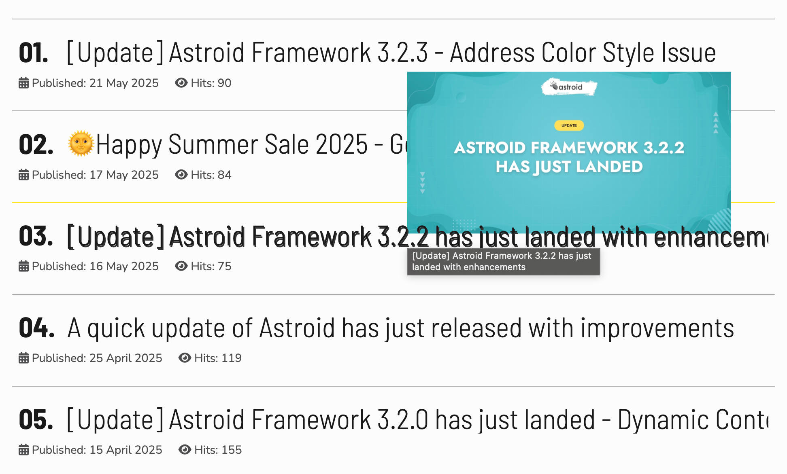
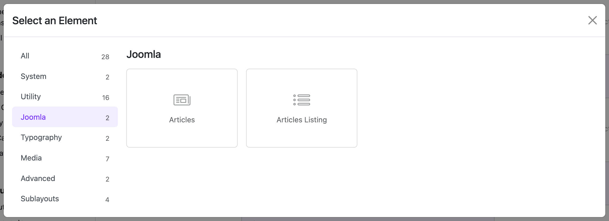
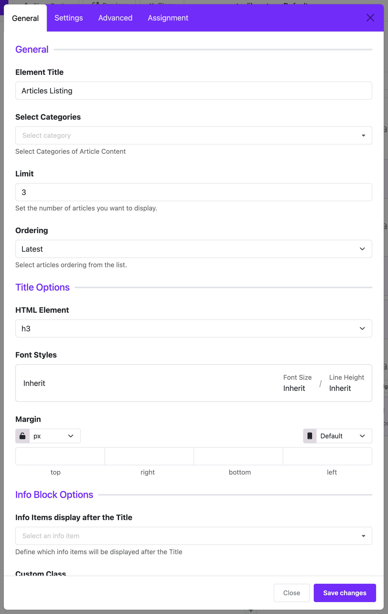

# Article Listing

The **Article Listing Widget** helps you display a list of Joomla articles on your website. You can choose which categories to show, how many articles to display, how they are sorted, and how the titles and info look.

This widget is great for showing blog posts, news, or featured content on your homepage or any section of your site.

:::info[Pro Feature]
This widget is available in the **Astroid Pro** version only. If you are using the free version, consider [upgrading to access this feature](https://moonframe.work/pricing).
:::

---

## 🔧 What You Can Do With This Widget

- Show articles from selected Joomla categories.
- Control the number of articles displayed.
- Sort articles by date, popularity, or name.
- Show or hide author name, category, date, etc.
- Customize the look and feel of titles and metadata.

---

## ⚙️ How To Set It Up

### **Article Source Settings**

These settings let you choose which articles to show.

- **Select Categories:**  
  Pick one or more categories where your articles are stored.

- **Number of Articles:**  
  Enter how many articles you want to show (e.g., 3, 5, 10).

- **Order By:**  
  Decide the order of articles:
  - Latest (most recent)
  - Oldest
  - Popular (most viewed)
  - Featured
  - A to Z (Alphabetical)
  - Z to A
  - Random

---

### **Title Options** (Heading Settings)

These settings control how the title of each article appears.

- **HTML Element:**  
  Choose the size of the title (e.g., h1, h2, h3, etc.).  
  Default is usually `h3`.

- **Font Style:**  
  Customize the font size, weight (bold), color, and other text styles.

- **Spacing (Margin):**  
  Add space above or below the title for better layout.

---

### **Info Options** (Article Info)

These settings show extra information under each article title.

- **What Info to Show:**  
  You can choose to show:
  - Author
  - Category
  - Publish Date
  - Create Date
  - Modify Date
  - Number of Views (Hits)

- **Spacing:**  
  Add space between the title and the info text.

- **Font Style:**  
  Change how the info text looks (font, size, color, etc.).

---

### **Assignment Settings**

These settings control **where** the widget will appear on your website.

- **Show On:**
  - All Pages: Widget appears on every page.
  - No Pages: Widget is hidden.
  - Selected Pages: Show the widget only on certain menu pages.

- **Menu Selection:**  
  If you choose "Selected Pages", you can pick the specific menu items.

---

## 💡 Tips

- Use this widget in a Grid or Section layout to keep your site clean and well-organized.
- Combine it with styling options for a better look.
- Keep the number of articles small for faster loading (3–5 is a good number).
- Use clear, readable fonts for titles and info.

---

## ✅ Example

Want to show the 3 latest news posts from the "News" category on your homepage? Just:

1. Select "News" in **Select Categories**
2. Set **Number of Articles** to 3
3. Set **Order By** to "Latest"
4. Choose to show **Publish Date** and **Author**
5. Assign the widget to the **Home** menu page

---

This widget is perfect for building dynamic, professional-looking article sections without needing to code.