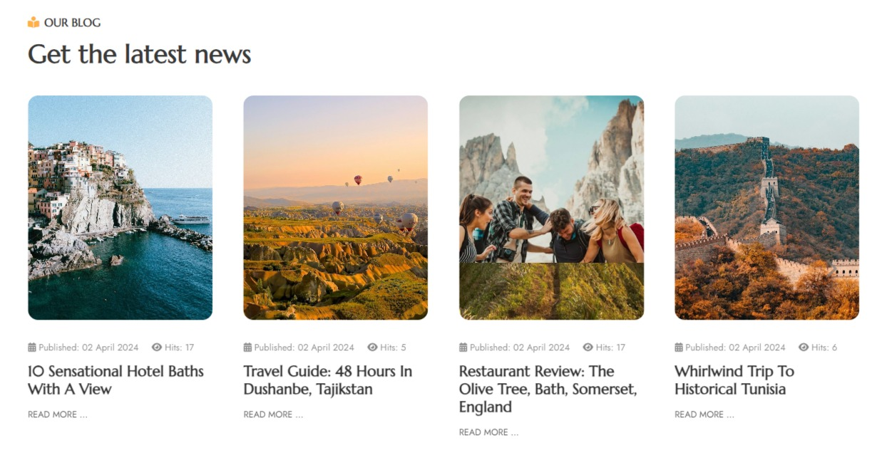
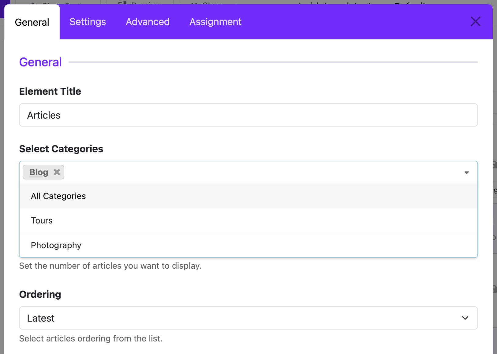
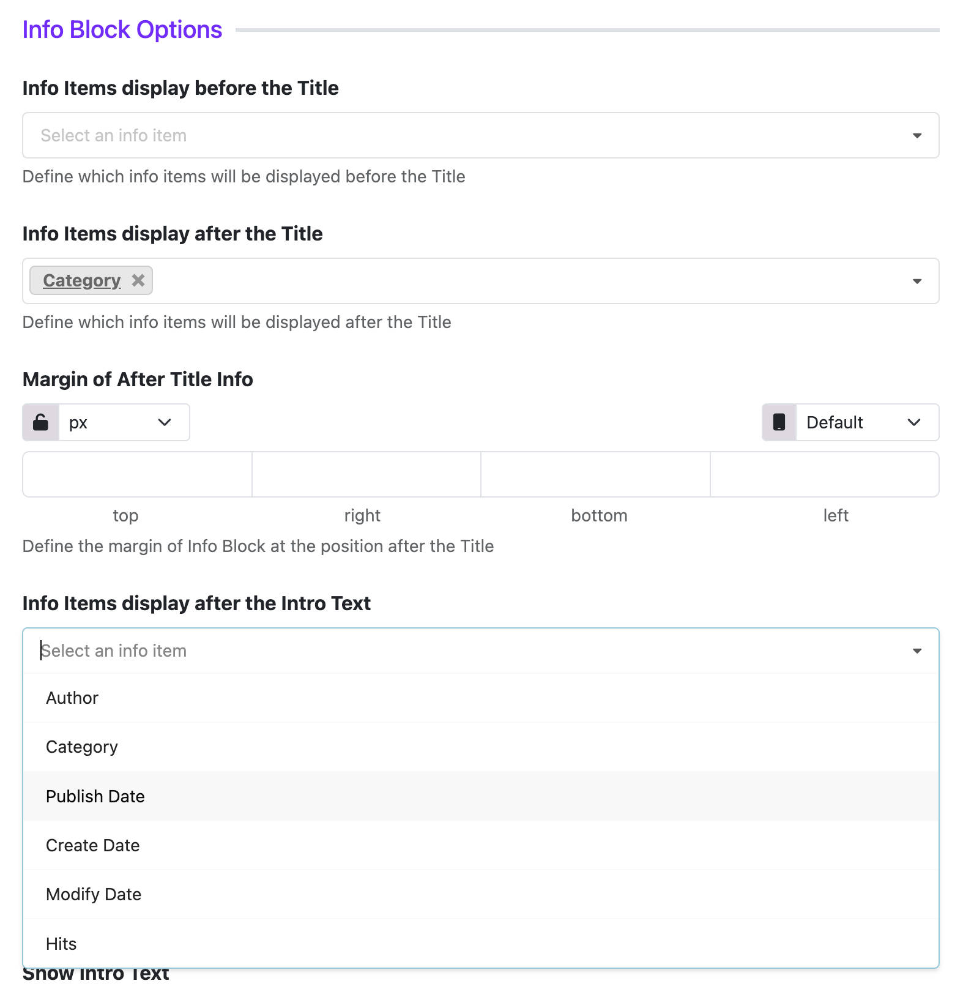

# Articles

> The **Article Widget** allows you to display selected Joomla articles directly in your Astroid layout. You can customize how each article looks and where it appears on the page.

---

## 🔰 1. What is the Article Widget?

The **Article Widget** is a drag-and-drop element in the **Astroid Layout Builder**. It lets you choose specific Joomla articles and display them with various layout options, such as:
- Title
- Featured image
- Intro text
- Published date
- Category
- "Read more" button

---

## 🛠️ 2. How to Add an Article Widget

### ✅ Step 1: Open Layout Builder
1. Go to your Joomla **Administrator Panel**
2. Navigate to: `System` → `Site Template Styles` → Click on your **Astroid template**
3. Click the **“Template Options”** button
4. Open the **Layout** tab
5. Launch the **Layout Builder**

### ✅ Step 2: Insert the Article Widget
1. Choose a column (`col`) where you want to place the widget
2. Click **“Add Element”** or the `+` icon
3. From the popup, select **“Widgets”** → Click **“Article”**

---

## ⚙️ 3. Article Widget Settings

Once added, you’ll see multiple configuration options:

### 📝 Basic Settings
- **Title**: Optional title for the widget block
- **Select Categories**: Choose specific categories to filter articles
- **Limit Articles**: Set how many articles to display (e.g., 5, 10)
- **Order By**: Choose how to sort articles (e.g., by date, title, etc.)

### 📑 Grid Settings

- **Columns**: Set how many columns to display articles in (e.g., 1, 2, 3)
- **Gutter**: Adjust spacing between articles
- **Use Masonry**: Enable masonry layout for a Pinterest-style look

### 🖼️ Image Settings

- **Choose Layout**: Select how to display the featured image (e.g., Classic, Image Overlay)
- **Thumbnail Only**: Show only the thumbnail without the article type media
- **Border Radius**: Set the border radius for images (e.g., 0px, 5px, 10px)
- **Enable Image Effect**: Add hover effects like zoom or grayscale

### ⚙️️ Info Block Options
- **Info Block Position**: Choose where to display the article info (e.g., before title, after title, or after content)
- **Select Info Block Fields**: Choose which fields to show in the info block, such as:
  - Author Name
  - Category Name
  - Published Date
  - Created Date
  - Modified Date
  - Hits

### 🎨 Style Options
- You can add custom **CSS classes**
- Control spacing using **padding/margin** settings

---

## 👁️ 4. Preview and Save

1. After configuring the widget, click **“Save Layout”**
2. Visit your website’s frontend to preview how the articles appear

---

## 💡 5. Tips for Best Results

- Use high-quality **featured images** for better visual impact
- Add multiple Article Widgets in different layout sections to group articles by topics
- Use **custom CSS** if you want to fine-tune the appearance

---

## ❓ 6. Frequently Asked Questions (FAQ)

**❓ My article is not showing up on the page**  
👉 Make sure the article is **Published** and has **Public access**

**❓ Can I select multiple categories at once?**  
👉 Yes! Hold `Ctrl` (Windows) or `Cmd` (Mac) to select multiple categories in the widget settings