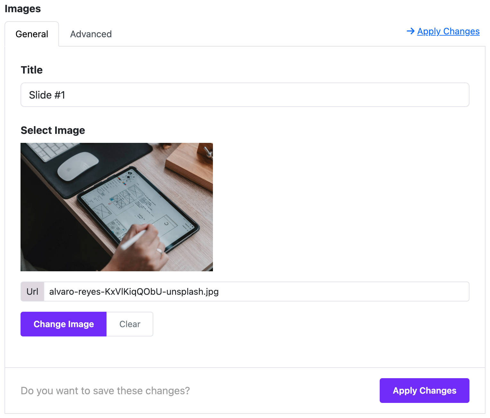

# Hover Motion Gallery

The **Hover Motion Gallery** widget lets you create a beautiful image gallery with hover effects. Perfect for showing off photos, products, or any visual content with style.

:::info[Pro Feature]
This widget is available in the **Astroid Pro** version only. If you are using the free version, consider [upgrading to access this feature](https://moonframe.work/pricing).
:::

---

## 🔧 Step-by-Step Setup Guide

### 1. 🧩 Add the Widget

- Go to **Astroid Template > Layout Manager**.
- Choose a position where you want to add the gallery.
- Click **“+”** to add a new widget.
- Select **"Hover Motion Gallery"** from the widget list.

---

## 2. ⚙️ General Settings

These settings control how the gallery looks and behaves.

### 📷 Add Images

- Under **Images**, click **“Add Item”** to add an image.
- For each image:
    - **Title**: Enter a short name or caption.
    - **Image**: Upload or choose an image from your media library.

💡 Tip: Add multiple images to create a full gallery.

---

### 🎨 Style Your Gallery

Inside the **Widget Styles** section:

- **Rows**  
  Choose how many image rows you want (e.g. 3 or 5).

- **Height**  
  Set how tall the gallery should be (like `80vh` or `600px`).

- **Angle**  
  Choose the tilt angle for the hover motion (default is -5°).

- **Gap**  
  Set the space between the images (like `1rem`).

- **Background Gradient**  
  Add a background color or gradient behind your images.

---

### 👁️ Show or Hide Details

- **View Detail**  
  Turn ON to show extra content when users hover on images.

- **Shuffle Images**  
  Turn ON to display images in a random order each time.

---

### 🟦 Image Shape

- **Border Radius**  
  Change the shape of your images:
    - None (default)
    - Rounded corners
    - Circle
    - Pill shape

- **Rounded Size**  
  If you choose "Rounded", select how round the corners should be (small, medium, large, etc.)

---

## 3. 📍 Where to Show the Widget

- Go to the **Assignment Settings** section.
- Choose when the gallery appears:
    - **All Pages** – show everywhere.
    - **No Pages** – don’t show at all.
    - **Selected Pages** – show only on specific menu items.

---

## 📌 Tips for Best Results

- Use high-quality images that are the same size.
- Avoid using too many rows to keep it fast and clean.
- Try different gradients and angles for fun effects.

---

## ✅ You're Done!

Click **Save** and check your website — your gallery should now be live!

> If you don’t see it, make sure the widget is assigned to a visible page and position.

---

## 📷 Example Use Cases

- Portfolio with photo previews
- Team member cards with hover details
- Product showcase with stylish effects

---

## 💡 Summary Table

| Option            | What It Does                          |
|-------------------|----------------------------------------|
| Add Image         | Upload and label your gallery items    |
| Rows              | Set how many image rows to show        |
| Height            | Define how tall the gallery is         |
| Angle             | Tilt images when hovered               |
| Gap               | Space between the images               |
| Background        | Gradient behind gallery                |
| View Detail       | Show more content on hover             |
| Shuffle           | Randomize images on each page load     |
| Border Radius     | Control the shape of the image         |
| Assign Pages      | Choose where the widget appears        |

---

Need help or want to see a live preview? Visit the **Astroid Documentation** or reach out to your template developer.