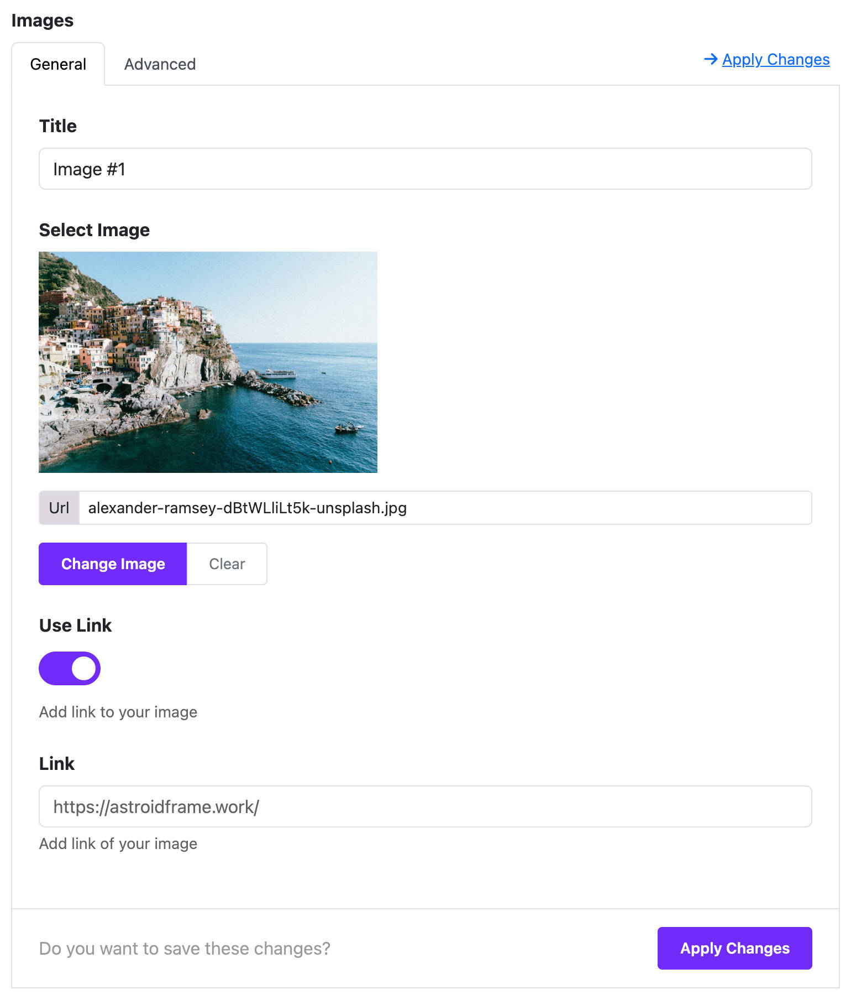

# Image Carousel

The **Image Carousel Widget** lets you create a sliding image gallery on your website. It’s perfect for displaying banners, portfolios, client logos, or any image showcase.

---

## 📍 Step 1: Open the Layout Builder

1. Go to your Joomla **Administrator Panel**
2. Navigate to: `System` → `Site Template Styles` → Click on your **Astroid template**
3. Click the **“Template Options”** button
4. Open the **Layout** tab
5. Launch the **Layout Builder**

---

## 🧱 Step 2: Add the Image Carousel Widget

1. In the layout builder, find the section where you want to place the image carousel (you can also create a new section).
2. Click the **“+ Add Widget”** button.
3. Search for and select **Image Carousel** from the list.

---

## 🖼️ Step 3: Add Images to the Carousel

After adding the widget, you will see configuration options.

1. Click **“+ Add Item”** to add a new image.
2. For each item, you can set:
    - **Image**: Upload or choose from the media manager.
    - **Title**: Optional heading for the image.
    - **Description**: Optional text under the image.
    - **Link**: Optional link when the image is clicked.
    - **Open in New Tab**: Choose if the link should open in a new tab.

💡 You can add **multiple images**, and they will slide automatically or manually.

---

## ⚙️ Step 4: Configure Carousel Settings

You can control how the carousel behaves using these settings:

| Setting              | Description                                 |
|----------------------|---------------------------------------------|
| **Autoplay**         | Automatically slide images                  |
| **Autoplay Timeout** | Time between slides (in milliseconds)       |
| **Loop**             | Start again when the last image ends        |
| **Navigation Arrows**| Show left and right arrows                  |
| **Dots Navigation**  | Show dots below to indicate current slide   |
| **Items per screen** | Set how many images show on each device     |

**Example setup**:
- Desktop: 3 images
- Tablet: 2 images
- Mobile: 1 image

---

## 🎨 Step 5: Style the Carousel

You can adjust the appearance using these options:

- **Image Height**: Set a fixed height for uniform display.
- **Border Radius**: Round the corners of images.
- **Box Shadow**: Add shadow around image blocks.
- **Custom CSS Class**: Add your own CSS class (optional).

---

## 🎯 Use Case Examples

- **Homepage Banner Slider**
- **Client Logos Carousel**
- **Portfolio or Product Showcase**
- **Testimonial Images**

---

## 🧠 Helpful Tips

- Use images with **similar dimensions** for a clean layout.
- **Compress images** to improve loading speed.
- Keep image descriptions short and relevant.
- Test the carousel on **mobile devices** to ensure responsiveness.

---

## ✅ Summary

The **Image Carousel Widget** is a simple yet powerful tool in the Moon Framework. It helps you display a set of images with a smooth sliding effect—no coding required. Just drag, drop, upload images, and configure!