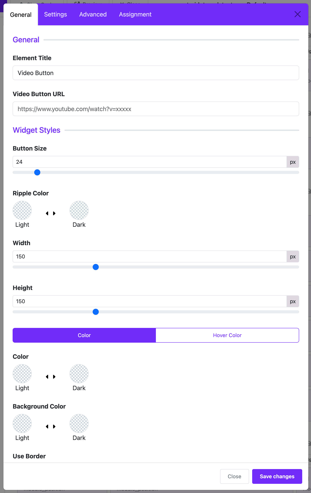

# Video Button

The **Video Button Widget** in Moon Framework allows you to create a clickable video play button that links to a video URL (e.g., YouTube). It's useful for embedding and triggering video modals or linking directly to video content.

## 📌 Features

- Customizable video URL
- Adjustable size, width, height
- Full control over colors (normal & hover)
- Optional border with customizable settings
- Flexible page assignment

---

## 🔧 How to Use

### Step 1: Add the Widget
- Open your Astroid layout (e.g., Home page).
- Click **+ Add Widget**.
- Choose **Video Button** from the Media category.

### Step 2: Configure General Settings

#### ▶ Video URL
- **URL**: Paste your video link (e.g., `https://www.youtube.com/watch?v=xxxxx`).

#### 🎨 Widget Styles

- **Button Size**: Set the size of the play icon (1–300px).
- **Ripple Color**: Choose a color for the ripple effect on click.
- **Width / Height**: Define the dimensions of the video button (10–500px).
- **Color / Hover Color Toggle**:
    - Choose between setting a normal color or hover color.
    - Depending on the toggle, configure:
        - **Color**: Button color in normal state.
        - **Hover Color**: Button color when hovered.
        - **Background Color**: Background color in normal state.
        - **Hover Background Color**: Background color when hovered.

#### 🖌 Border Options
- **Use Border**: Enable/disable border.
    - If enabled:
        - **Border Width**: Thickness of the border (1–50px).
        - **Border Color**: Select border color.

---

## 🗂 Assignment Settings

Determine where this widget appears on your site:

- **On All Pages** – Show on every page.
- **No Pages** – Hide the widget.
- **Selected Pages** – Display only on specific menu items (select menus using the list).

---

## 📝 Tips

- For best design, keep button dimensions proportional.
- Use consistent color themes matching your template.
- Link only to trusted video sources (YouTube, Vimeo, etc.).

---

## 🛠 Troubleshooting

- **Button Not Showing?**
    - Make sure the assignment setting includes the current page.
    - Ensure no conflicts in layout or display conditions.
- **Video Not Opening?**
    - Check if the URL is valid and publicly accessible.

---

## ✅ Use Cases

- Hero section with a play button to showcase intro video.
- Testimonial videos in service sections.
- Interactive tutorial launches.