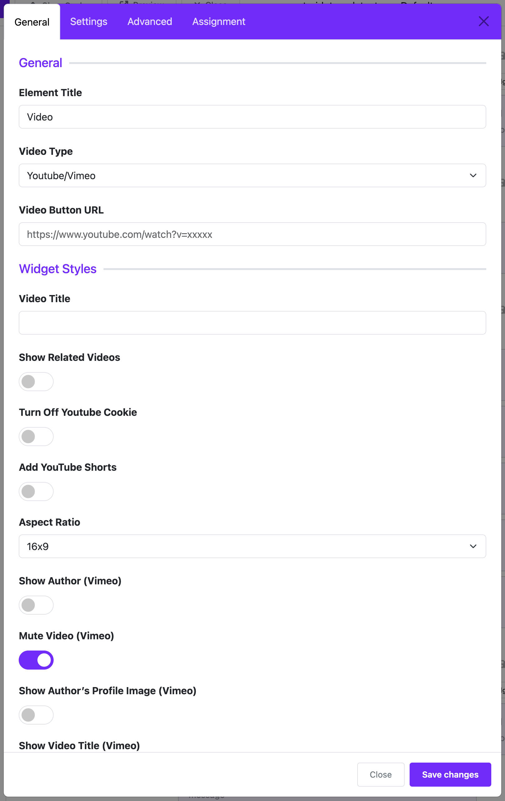

# Video

## ✅ Introduction

The **Video Widget** in Moon Framework allows you to embed videos from **YouTube**, **Vimeo**, or **self-hosted video files** directly into your Joomla website with ease and style.

---

## 🧩 How to Add a Video Widget

1. Open the **Astroid Layout Builder**.
2. Choose the section where you want to place the video.
3. Click **“Add Item”**.
4. Select **“Video”** from the widget list.

---

## ⚙️ Video Widget Settings

### 1. **Video Type**

Choose the source of the video:

- `YouTube`
- `Vimeo`
- `Self Hosted` (MP4/WebM/Ogg)

### 2. **Video URL**

- For **YouTube/Vimeo**: Paste the video URL (e.g., `https://www.youtube.com/watch?v=abc123`)
- For **Self Hosted**: Provide the full path to the video file or choose a file from Joomla Media Manager.

### 3. **Image Poster** (Thumbnail)

- Applicable for self-hosted videos.
- This is the placeholder image shown before the video plays.

### 4. **Autoplay**

- ✅ Enable to let the video play automatically on page load.
- ❌ Disable to require user interaction to play.

> ⚠️ **Note**: Autoplay might be blocked by browsers unless the video is muted.

### 5. **Loop**

- ✅ The video will restart automatically after it ends.

### 6. **Mute**

- ✅ The video will play without sound.
- Useful in combination with Autoplay to comply with browser policies.

### 7. **Controls**

- ✅ Show playback controls (play, pause, volume, etc.)
- ❌ Hide controls for minimal display or background video effect.

---

## 🎨 Display Customization

- **CSS Class**: Add custom classes for styling with your CSS rules.
- **Alignment**: Align the video (left, center, right) within its container.
- **Responsive**: The widget is fully responsive and adapts to all screen sizes.

---

## 💡 Tips for Best Use

- Use a high-quality poster image for self-hosted videos to improve aesthetics.
- Optimize video file size for better page loading speed.
- Combine with background sections or overlays to make video content more engaging.

---

## 📌 Example Configuration

### Embed a YouTube Video

- **Video Type**: YouTube
- **Video URL**: `https://www.youtube.com/watch?v=abc123`
- **Autoplay**: ✅
- **Mute**: ✅
- **Loop**: ❌
- **Controls**: ✅

---

## 🧽 Conclusion

The **Video Widget** is a powerful and easy-to-use tool for embedding rich media into your Joomla website using the Moon Framework. Whether showcasing a promotional video or adding visual storytelling, you can enhance user experience with just a few clicks.