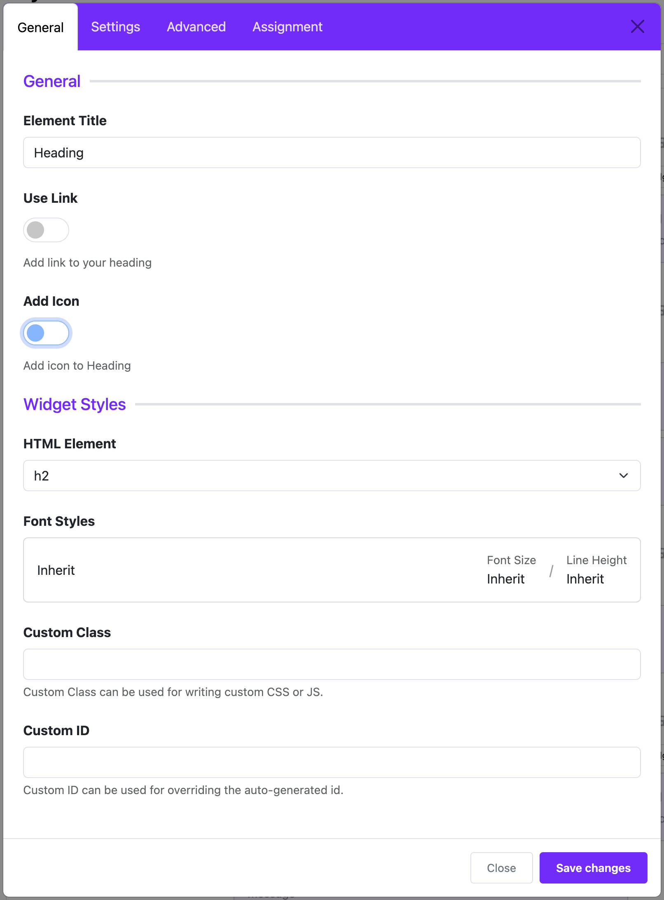

# Heading

The **Heading Widget** is used to add titles or headings to your layout. These can be main titles or section subtitles that help organize content visually.  
**Example:** You can use it to display headings like _“About Us”_ or _“Our Services”_ on your website.

---

## 🛠 How to Add a Heading Widget

1. Open the **Astroid Layout Builder** in your Joomla administrator panel.
2. Find the section (like Header, Main, Sidebar, or Footer) where you want to add the heading.
3. Click **Add Item** → choose **Heading**.

---

## ⚙️ How to Configure It

### 1. **Enter Your Heading Text**

- Use the **Title** field to type the heading you want to display.  
  _Example: “Featured Products”_

---

### 2. **Make the Heading Clickable (Optional)**

- Turn on the **Use Link** switch if you want the heading to link to another page.
- Fill in the **Link** field with the URL.  
  _Example: `/products`_

---

### 3. **Add an Icon (Optional)**

- Turn on the **Add Icon** switch to display an icon beside your heading.
- Choose an icon you like from the list.
- You can also select a color for the icon using **Icon Color**.

---

### 4. **Choose the Heading Level (HTML Element)**

- In the **HTML Element** field, choose what type of HTML tag the heading will use:
    - `h1` → Largest (used for main headings)
    - `h2` to `h6` → Smaller headings
    - `div` → A regular block, not treated as a heading by search engines

⚠️ _Recommendation: Use only one `h1` per page for SEO. Use `h2`, `h3`, etc., for subheadings._

---

### 5. **Style the Text (Advanced)**

- Use the **Font Style** field to set typography like font family, size, weight, spacing, etc.
- This allows you to match the look and feel of your site.

---

### 6. **Where Should the Heading Show Up?**

- In the **Assignment Settings** section:
    - **All Pages** – show the heading on every page.
    - **No Pages** – don’t show it at all (used for testing or drafts).
    - **Selected Pages** – choose specific menu items where the heading will appear.

---

## ✅ Tips for Better Use

- Use **`h1`** for your main page heading only.
- Pair icons with text for better visual appeal.
- If the heading does not show on the frontend, check the **Assignment Settings** to make sure it is assigned to the correct pages.

---

## 📷 Example Setup

Let’s say you want a heading that says:

> 🏆 **Featured Products**  
> (links to `/products`)

### Setup:

| Setting              | Value                  |
|----------------------|------------------------|
| **Title**            | Featured Products      |
| **Use Link**         | ON                     |
| **Link**             | `/products`            |
| **Add Icon**         | ON                     |
| **Icon**             | Trophy (`fa-trophy`)   |
| **HTML Element**     | `h2`                   |
| **Font Style**       | Bold, 32px, optional   |

---

Would you like an illustration or downloadable version of this guide?