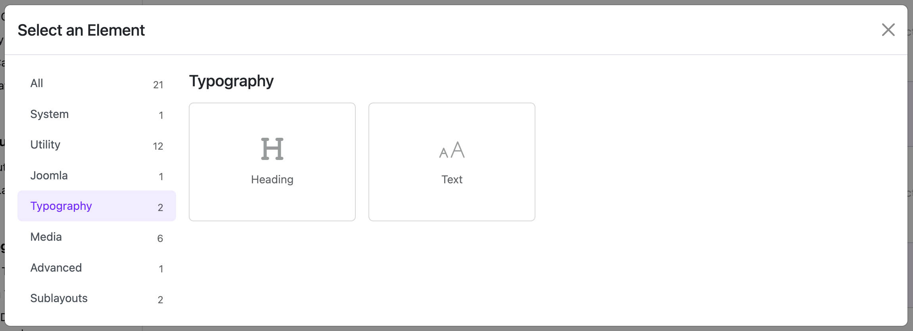
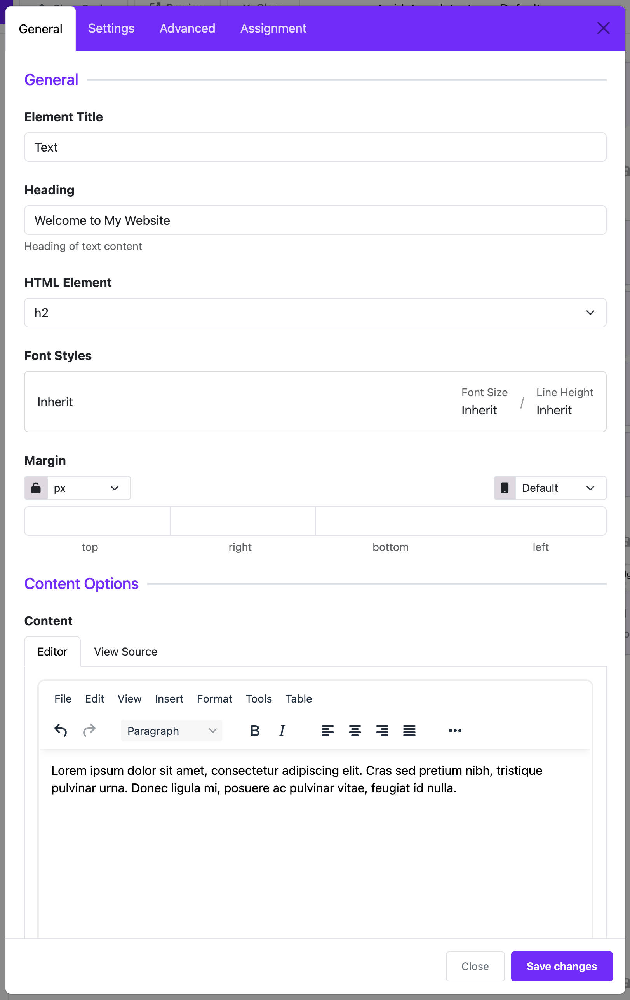

# Text

The **Text Widget** helps you add headings and text content to your Joomla website. It's useful when you want to show titles, paragraphs, or any kind of text with full control over how it looks and where it shows up.

---

## 🔧 What You Can Do with This Widget

- Add a **title** (heading) like “Welcome to My Website”
- Add **content** (paragraphs, links, formatted text, etc.)
- Choose how your text looks (font, size, spacing)
- Control how your content looks on different devices (desktop, tablet, phone)

---

## 📂 Settings Guide (Step-by-Step)

### 1. **Heading**
- **What it does**: Shows a title above your text.
- **Example**: “About Us”, “Contact Information”
- You can choose what kind of heading it is: `h1`, `h2`, `h3`, etc.
- Customize the **font style** (font family, size, color).
- Add **margin** to give space around the heading.

### 2. **Content**
- **Where you write your main text.**
- It’s a rich text editor, so you can format the text, add links, images, etc.
- Example:
  > Welcome to our website. We provide the best services in town!

### 3. **Responsive Layout**
- This controls how wide your text area is on different screen sizes.
- Choose screen size: **Extra Large**, **Large**, **Medium**, **Small**, **Extra Small**
- Then choose how wide the text should be:
    - `1/2` = Half width
    - `1/3` = One third
    - `1/4`, `1/5`, `1/6`...

💡 *Tip: You can make text smaller on mobile and wider on desktop for a better layout.*

### 4. **Content Style**
- Choose font, size, spacing for the **content text** just like with the heading.

---

## 📋 Page Assignment

- Choose **where** this widget will appear:
    - All pages
    - No pages
    - Only selected pages (you pick from the menu)

---

## ✅ Example Use

Imagine you want a block on your homepage that says:

> **Welcome to Our Clinic**  
> We have been serving patients for over 20 years with love and care.

With Text Widget, you can:
- Set "Welcome to Our Clinic" as a heading (`h2`, bold, large font)
- Write the rest in the content editor
- Set it to show only on the homepage
- Make sure it looks good on both desktop and phone

---

## 🛠️ Tips for Beginners

- If you don’t need a heading, just leave it blank.
- Use the **preview** to see how it will look.
- Use the **assignment settings** to control where it shows up.