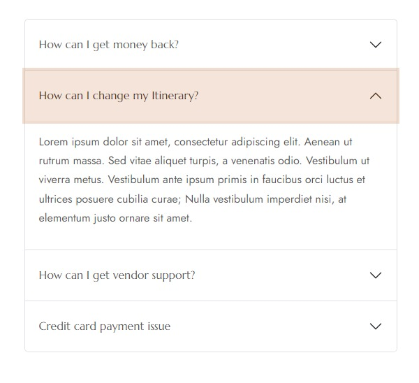
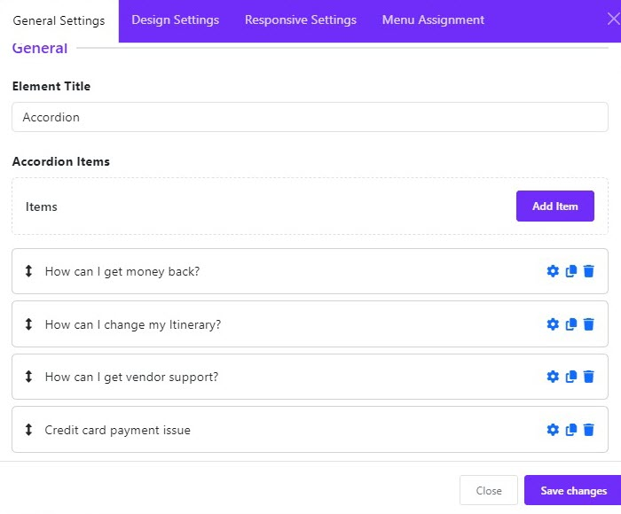
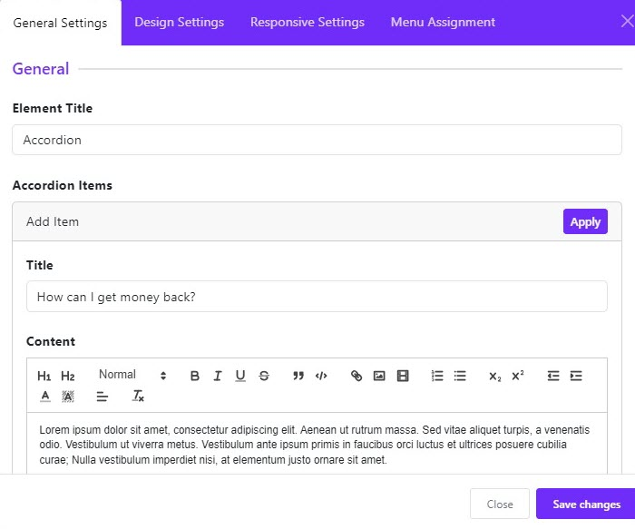
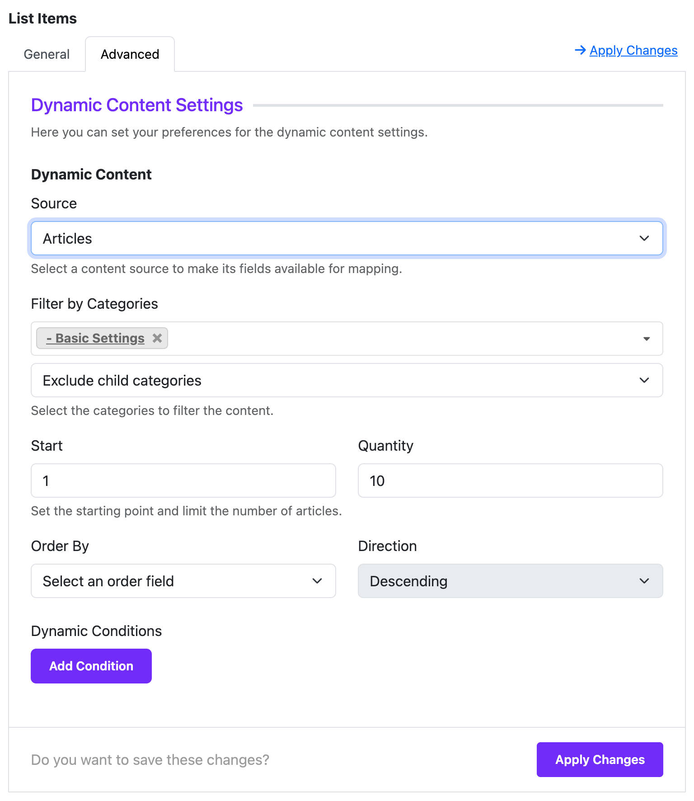
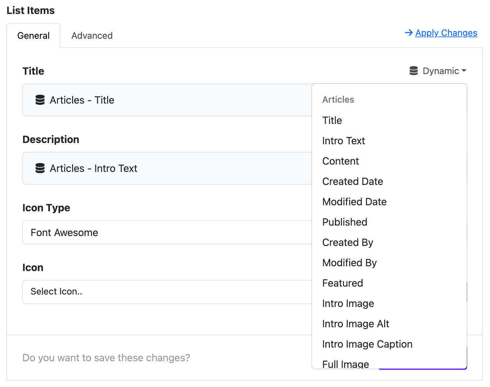

# Accordion

The **Accordion Widget** allows you to display collapsible content sections. It's perfect for FAQs, grouped content, or keeping your pages clean and easy to navigate.

---

## 🧩 What is an Accordion?

An **Accordion** is a content layout where users can click on a title to expand or collapse a content section underneath. It's useful when you want to organize a lot of content in a compact space.

---

## 📦 Where Can You Use It?

You can add the Accordion Widget anywhere within your layout using the **Astroid Layout Builder**. Just insert it into any column as a **widget element**.

---

## ⚙️ Widget Configuration

Once added, you can configure the widget through several grouped settings:

### 🔘 1. General Settings

#### ✅ Accordion Items
This is where you add the content for your accordion. Each item includes:
- **Title**: The clickable heading
- **Content**: The text or HTML displayed when expanded

#### ➕ How to Add Items
1. Click **Add Item**
2. Enter a **Title** and **Content**
3. Repeat to add as many items as needed

---

### 🔄 1.1 Dynamic Content Settings (Optional)

Accordion Widget supports **Dynamic Content**, allowing each accordion item to load content automatically from other sources like Joomla articles, Joomla categories, or Joomla Users.

#### 🧠 What is Dynamic Content?
Instead of manually writing content for each item, you can link it to:
- A specific **article**
- A **category**
- Or Users source

#### ⚙️ How to Enable Dynamic Content
1. Under each Accordion Item, select **Advanced Settings** tab
2. Expand the **Dynamic Content Source** selection
3. Choose your desired **Dynamic Content Source**

#### 🔧 Available Dynamic Content Sources
- Joomla Articles
- Joomla Categories
- Joomla Users

#### 📌 Priority of Content
If **Dynamic Content** is enabled for an item, it will **override** the manually written content field.

#### 📝 Use Case Example
You want to display a list of tutorials from a Joomla category. Instead of writing each one manually:
- Click to **Dynamic** icon in each field
- The system will automatically pull and render the Joomla fields in the accordion item
- Select a **Joomla Field** as the dynamic source

> 💡 You can mix static and dynamic content — some items can have manually entered content, and others can pull from dynamic sources.

---

### 🎨 2. Widget Styles

#### 📌 Style
- **Default**: Regular look with spacing
- **Flush**: Borderless, modern compact design

#### 🧭 Collapse Behavior
- **Open First Item**: The first item is open by default
- **Close All**: All items are collapsed when the page loads

#### 🔁 Always Open
- If enabled, users can open multiple items at the same time

#### 🎨 Color Settings
Choose how colors behave:
- **Color**: Regular state
- **Hover**: When the mouse hovers
- **Active**: When the item is opened

You can customize both:
- **Text Color**
- **Background Color**  
  ...for each state (normal, hover, active)

---

### ✍️ 3. Typography

#### Title Options
Customize fonts for the accordion headers.

#### Content Options
Customize fonts for the content inside each accordion section.

---

### 📋 4. Assignment Settings

Where should this widget appear?
- **All Pages**: Show everywhere
- **No Pages**: Hide on all pages
- **Selected Pages**: Show only on selected menu items

---

## 💡 Tips for Better Use

- Great for FAQs or sectioned tutorials
- Use hover and active colors for a more interactive look
- Group related content into multiple accordions for better clarity

---

## ✅ Summary

The Accordion Widget is a flexible, user-friendly way to organize content on your Joomla site. With Astroid’s intuitive settings and styling options, anyone can create beautiful collapsible content without needing to code.

---

