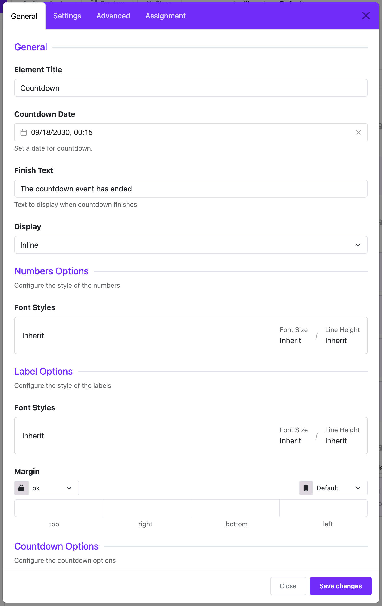

# Countdown

The **Countdown Widget** in Astroid allows you to display a countdown timer to a specific date and time. It's perfect for "Coming Soon" pages, event reminders, or campaign launches.

:::info[Pro Feature]
This widget is available in the **Astroid Pro** version only. If you are using the free version, consider [upgrading to access this feature](https://moonframe.work/pricing).
:::

---

## ➕ How to Add the Countdown Widget

### 📍 Step 1: Open the Layout Builder

1. Go to your Joomla **Administrator Panel**
2. Navigate to: `System` → `Site Template Styles` → Click on your **Astroid template**
3. Click the **“Template Options”** button
4. Open the **Layout** tab
5. Launch the **Layout Builder**

---

### 🧱 Step 2: Add the Widget
1. Open the **Astroid Layout Builder**.
2. Add a new **Widget** to your desired section.
3. Select **Countdown Widget** from the widget list.

---

## ⚙️ Main Configuration Settings

### 🗂 General Settings

#### 🕒 `countdown_date`
- **Description**: The target date/time for the countdown.
- **Format**: `YYYY/MM/DD HH:MM`
- **Default**: `2030/09/18 00:15`

#### 📝 `finish_text`
- **Description**: The text displayed when the countdown ends.
- **Example**: `"The event has ended"` or `"We're live!"`

#### 📐 `display_mode`
- **Display options**:
    - `Inline` (default)
    - `Block` (takes full width)

---

### 🔢 Numbers Options

#### `number_style`
- Typography settings for the countdown numbers, including font, size, spacing, etc.

---

### 🏷 Label Options

#### `label_style`
- Typography for the labels (e.g., Days, Hours, Minutes).

#### `label_margin`
- Spacing around each label (Top, Right, Bottom, Left).

---

### ⏲ Countdown Appearance Options

#### 🎨 `counter_bg_color`
- Background color of each countdown unit box.

#### 📏 `counter_width` and `counter_height`
- Set the size of each countdown block (30px to 500px).

#### 🧱 `counter_border`
- Border style including color, width, and style.

#### 🔲 `counter_border_radius`
- Border radius options:
    - `rounded` – Rounded corners
    - `0` – Square
    - `circle` – Fully circular
    - `pill` – Pill shape

#### 🌀 `counter_rounded_size` (Visible only when `rounded` is selected)
- Sets how much the corners are rounded:
    - X-Small, Small, Medium, Large, X-Large

---

### ⏰ Expired Countdown Options

#### `expired_style`
- Typography for the text that appears when the countdown ends.

---

## 📄 Assignment Settings

### `assignment_type`
- Controls where the widget is shown:
    - `On All Pages`
    - `No Pages`
    - `Selected Pages`

### `assignment`
- If you choose `Selected Pages`, assign the widget to:
    - Menu items
    - Specific categories or articles

---

## ✅ Final Notes

The Countdown Widget is a powerful way to attract attention to an upcoming event or launch. With full customization over style and visibility, it fits seamlessly into your site design.

---

### 💡 Tips

- Combine the **Countdown Widget** with **Text**, **Image**, or **Button Widgets** to build a compelling landing or "Coming Soon" page.
- Use strong contrast between text and background for maximum readability.