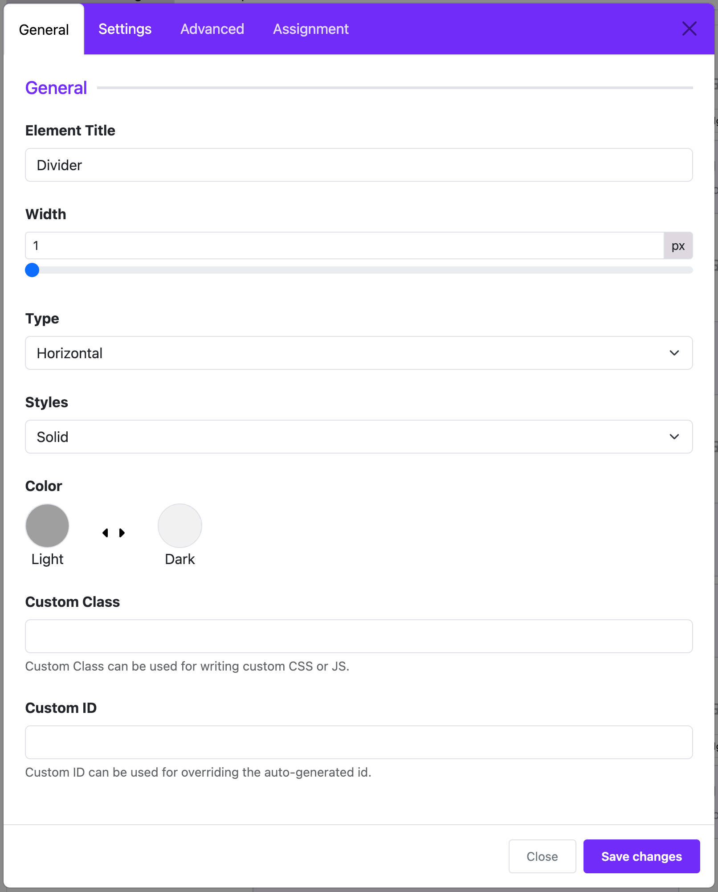

# Divider

The **Divider Widget** lets you add a line to your page to separate sections. This line helps make your website look cleaner and easier to read.

---

## 🧩 What is the Divider Widget?

The Divider Widget is used to place a simple line (either horizontal or vertical) between blocks of content. You can choose the line's **size**, **style**, **color**, and **where** it shows on your website.

---

## 🛠️ Step-by-Step Guide

### Step 1: Open Layout Builder
1. Go to your Joomla **Administrator Panel**
2. Navigate to: `System` → `Site Template Styles` → Click on your **Astroid template**
3. Click the **“Template Options”** button
4. Open the **Layout** tab
5. Launch the **Layout Builder**

### Step 2: Add the Divider Widget
1. Click on the **+ Add Section** or find the place where you want to add the divider.
2. Click **+ Add Element** inside a section or column.
3. Select **Divider** from the list of widgets.

---

## ⚙️ Divider Settings (Basic)

Once you add the Divider Widget, you will see some settings you can change.

### 🟦 1. Border Width
- **What it does**: Controls how thick the line is.
- **Default**: 1 pixel (px)
- **Tip**: You can drag the slider to make it thicker.

### ↔️ 2. Type
- **Options**:
    - **Horizontal** (line goes left to right)
    - **Vertical** (line goes up and down)
- **Tip**: Use vertical only if you want to split a row into columns.

### 📏 3. Height (for vertical line)
- **Only appears** if you choose **Vertical**.
- **What it does**: Sets how tall the vertical line is.

### 🎨 4. Style
- **Options**:
    - **Solid** (a solid line)
    - **Dashed** (line made of dashes)
    - **Dotted** (line made of dots)
- **Choose** the one that looks best for your site.

### 🌈 5. Color
- Click to choose the color of the line.
- You can match your site’s color theme.

---

## 📌 Where the Divider Appears

You can choose where the divider shows on your website.

### 🌍 Show On:
- **All Pages**: The divider will show on every page.
- **No Pages**: It won’t show at all.
- **Only Selected Pages**: Choose the menu items where it should appear.

### 📋 If you choose “Only Selected Pages”
- A new setting will appear.
- Select the menu items (like "Home" or "Contact") where you want the divider to be shown.

---

## 💡 Tips for Best Use

- Use **horizontal dividers** to break up large sections of content.
- Use **dashed or dotted styles** for a lighter feel.
- Use **color** to match your site's style.
- Place dividers between widgets to improve visual clarity.

---

## ✅ Finish and Save

Once you finish setting up:
1. Click **Save** in the Layout Builder.
2. Visit your site to see how the divider looks.

---

## 🎉 You’re Done!

Now you know how to add and use the Divider Widget in Astroid! It's a simple way to make your website look cleaner and more organized.