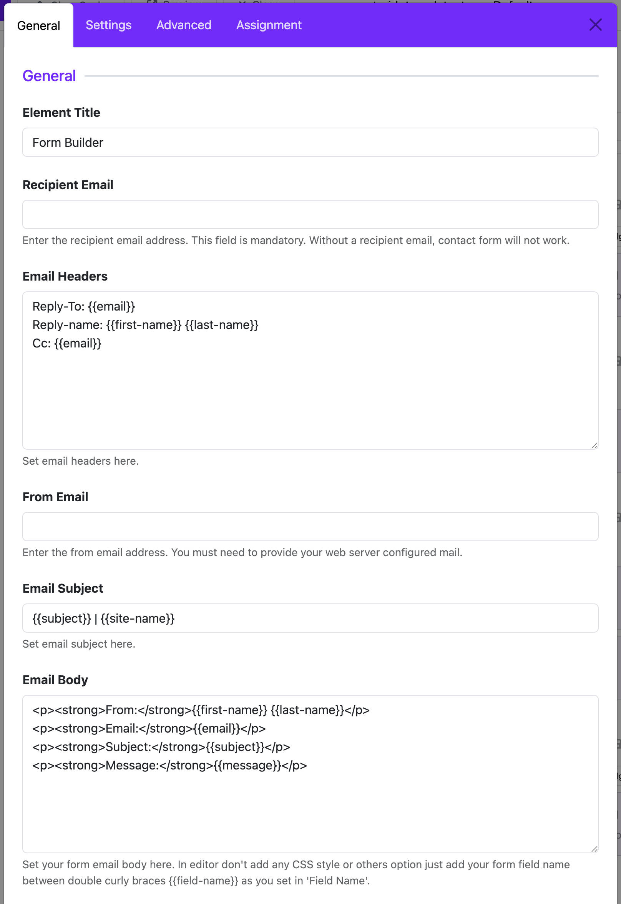
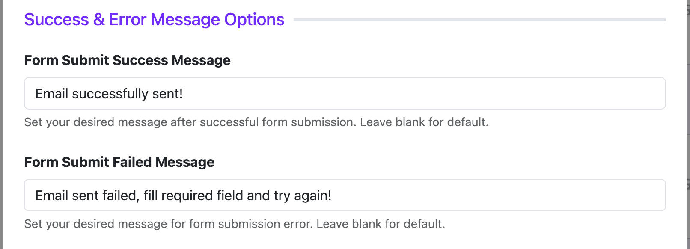
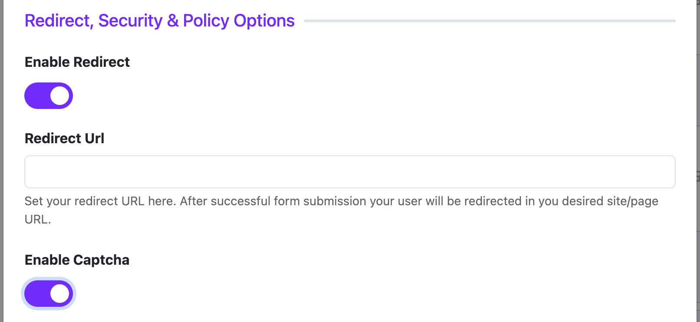
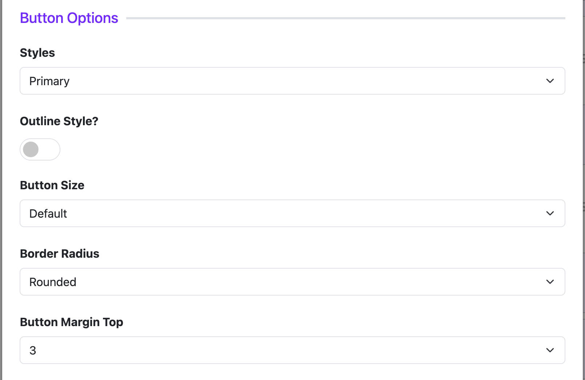
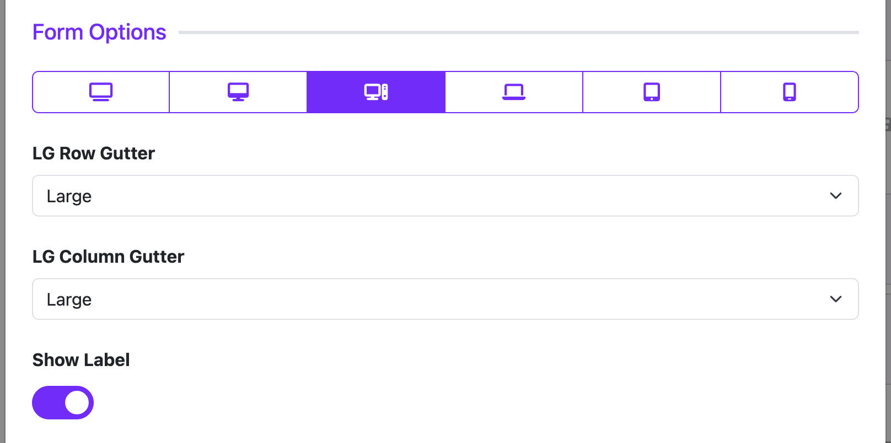
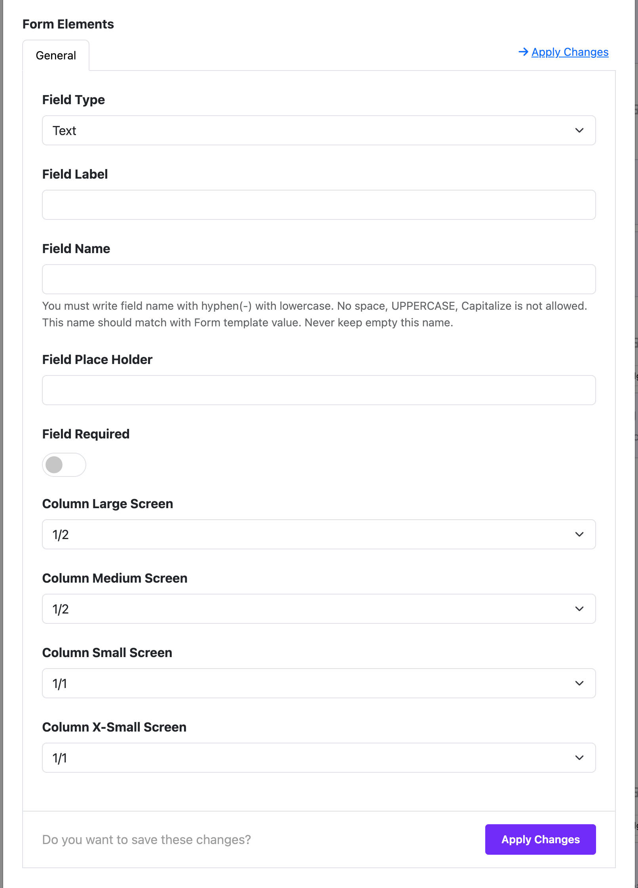

# Form Builder

The **FormBuilder Widget** helps you create custom forms like **Contact Us**, **Register**, or **Request Quote** easily—**no coding required**.

---

## 📌 What Can You Do with FormBuilder?

- Create **Contact**, **Feedback**, or **Registration** forms
- Collect information like name, email, message, etc.
- Send form data directly to your email
- Show custom success/failure messages
- Add CAPTCHA to protect from spam
- Customize layout and button design

---

## 🛠️ Step-by-Step Guide

### Step 1: Open Layout Builder
1. Go to your Joomla **Administrator Panel**
2. Navigate to: `System` → `Site Template Styles` → Click on your **Astroid template**
3. Click the **“Template Options”** button
4. Open the **Layout** tab
5. Launch the **Layout Builder**

### Step 2: Add the Form Builder Widget
1. Click on the **+ Add Section** or find the place where you want to add the form builder.
2. Click **+ Add Element** inside a section or column.
3. Select **Form Builder** from the list of widgets.

---

## 🛠️ Widget Configuration Overview

After you add the FormBuilder Widget to your layout, you’ll see several configuration sections. Here’s what each one does:

---

### 1. 📨 Email Settings

| Field | What it does |
|-------|--------------|
| **Recipient Email** | Where form submissions are sent |
| **From Email** | The "From" email in your inbox |
| **Email Subject** | Subject line of the email, e.g. `{{subject}} \| My Website` |
| **Email Body** | Main message. You can use variables like `{{first-name}}`, `{{message}}` |
| **Email Headers** | Add things like CC, Reply-To (optional) |

---

### 2. 💬 Submit Messages

| Field | Use |
|-------|-----|
| **Success Message** | What users see after submitting successfully (e.g. *"Thanks! Your message has been sent."*) |
| **Failure Message** | Shown if something goes wrong (e.g. missing required field) |

---

### 3. 🔐 Policy Options

| Option | Description |
|--------|-------------|
| **Enable Redirect** | After form is submitted, send user to a thank-you page |
| **Redirect URL** | The page URL to go to after submission |
| **Enable CAPTCHA** | Adds spam protection with a CAPTCHA check |

---

### 4. 🎨 Button Options

Customize how your submit button looks.

- **Button Style**: Choose from Bootstrap styles like *Primary*, *Secondary*, *Danger*, etc.
- **Outline Style**: Switch to outlined button look
- **Button Size**: Large, Small, or Default
- **Corner Radius**: Rounded, Square, or Pill
- **Top Margin**: Space above the button

---

### 5. 🧱 Form Layout & Responsive Settings

These settings let you control how the form looks on different screen sizes:

| Setting | Purpose |
|---------|---------|
| **Show Labels** | Show or hide field labels above inputs |
| **Responsive Layout** | Select screen size base: `lg`, `md`, `sm`, etc. |
| **Gutter Settings** | Space between columns and rows (per screen size)

---

### 6. ➕ Adding Form Fields

Use the **Form Elements** section to add your form inputs.

#### Supported Field Types:
- Text
- Email
- Phone
- Textarea (multi-line text)
- Select, Radio, Checkbox (for options)
- Date, Range, Number

**Each field lets you set:**
- **Label**: The name shown to users
- **Field Name**: The technical name used in email template (e.g. `first-name`)
- **Placeholder**: Hint text inside the input
- **Required**: Yes/No
- **Column Size**: Control how wide the field is on desktop, tablet, mobile

#### For Select, Radio, Checkbox:
You can define multiple options, set default selected, etc.

---

## 📋 Display Control (Assignment)

Choose **where** your form appears:

- **All Pages**
- **No Pages**
- **Only on Selected Pages** – you choose which menu items

---

## 🧪 Example: Contact Form

> 👤 Fields:
> - Full Name (Text)
> - Email (Email)
> - Message (Textarea)
>
> 📩 Send to: `support@example.com`  
> 🧾 Subject: `Contact Request from {{first-name}}`  
> ✅ Show success message  
> 🔐 Enable CAPTCHA  
> 🌐 Show only on *Contact Us* page

---

## ✅ Quick Tips

- Use variables like `{{email}}`, `{{subject}}` inside your email settings.
- If emails are not received, check your **spam folder** or **email server settings**.
- Always enable CAPTCHA for public forms to block spam.