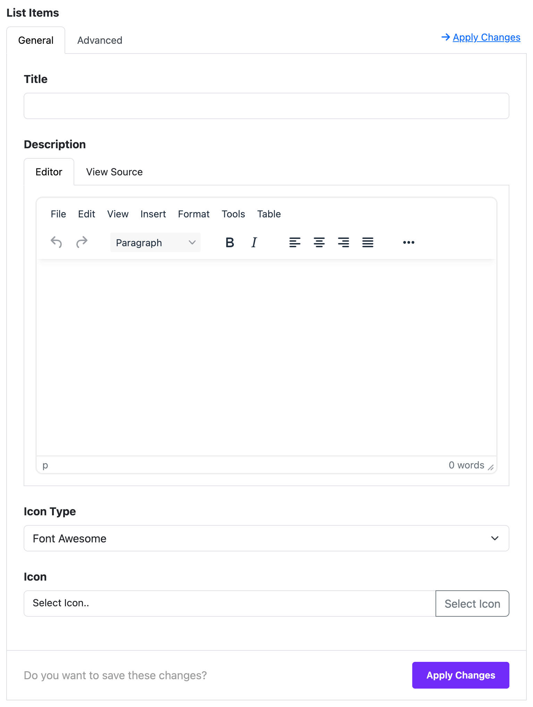

# List

The **List Widget** in Moon Framework helps you create styled lists with icons, descriptions, and various formatting options. It's perfect for displaying feature lists, contact details, or any list-based content in a customizable layout.

---

## 🚀 How to Use List Widget

### 📍 Step 1: Open the Layout Builder

1. Go to your Joomla **Administrator Panel**
2. Navigate to: `System` → `Site Template Styles` → Click on your **Astroid template**
3. Click the **“Template Options”** button
4. Open the **Layout** tab
5. Launch the **Layout Builder**

---

### 🧱 Step 2: Add the List Widget

1. In the layout builder, find the section where you want to place the image carousel (you can also create a new section).
2. Click the **“+ Add Widget”** button.
3. Search for and select **List** from the list.

---

## ⚙️ General Settings

### 📝 Add List Items
You can add multiple list items, each with the following:

- **Title**: Enter the main text for your list item.
- **Description**: Optional. Add supporting text under the title.
- **Icon Type**:
    - `Font Awesome`: Choose an icon from Font Awesome library.
    - `Custom`: Provide your own CSS class for a custom icon.
- **Icon**: Select an icon or enter a custom class depending on the type.

To add more items, click **Add Item**.

---

## 🎨 Styling Options

### 📋 List Style
Set the overall style of the list using the **List Style** dropdown:
- `Unordered List`: Default bullet list.
- `Ordered List`: Numbered list.
- `Unstyled List`: No bullets or numbers.
- `Inline`: Items appear inline.
- `Description List`: Items display as title-description pairs.
- `List Group`: Bootstrap styled group.
- `List Group Flush`: Removes padding.
- `List Group Numbered`: Numbered group list.

> 💡 If you choose **Description List**, you can also adjust the **Title Width** using a column range (1-12 columns).

---

## 🧩 Title Options

- **HTML Element**: Choose the tag for item titles (`h1` to `h6`, or `div`).
- **Font Style**: Adjust the typography for titles.
- **Heading Margin**: Customize spacing around the title.

---

## 🖋️ Content Options

- **Font Style**: Adjust the typography for the description (if used).

---

## 📏 Spacing Options

- **Item Margin**: Set the spacing between list items.
- **Item Padding**: Set internal spacing within each item.

---

## 📦 Misc Options

- Grouped with the **General Settings**, these options affect the widget's overall presentation and structure.

---

## ⚡ Dynamic Content (Optional)

You can load list data dynamically:
- Enable **Dynamic Content Source** inside a list item.
- Configure your data source to auto-populate the fields.

---

## 📄 Assignment Settings

Control where the widget appears:
- `All Pages`: Show everywhere.
- `No Pages`: Disable the widget.
- `Selected Pages`: Assign to specific menu items.

> When "Selected Pages" is selected, use the menu selector to choose where the widget is shown.

---

## ✅ Tips & Best Practices

- Keep titles short and icons relevant for better visual impact.
- Use **List Group** styles for more polished Bootstrap-like layouts.
- Combine **dynamic content** with the list for data-driven items.

---

## 📌 Example Use Cases

- ✅ Features List
- 📱 Contact Information
- 🛠️ Service Highlights
- 📚 Resource/Document Lists

---

Enjoy creating dynamic and beautiful lists with Astroid! 💡