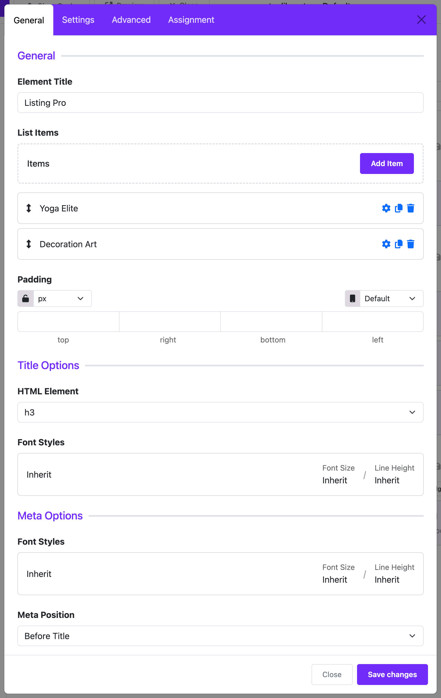

# Listing Pro

Display a customizable list of items with images, titles, descriptions, and links. Ideal for showcasing services, features, team members, or posts.

:::info[Pro Feature]
This widget is available in the **Astroid Pro** version only. If you are using the free version, consider [upgrading to access this feature](https://moonframe.work/pricing).
:::

---

## 🛠 How to Use

### 📍 Step 1: Open the Layout Builder

1. Go to your Joomla **Administrator Panel**
2. Navigate to: `System` → `Site Template Styles` → Click on your **Astroid template**
3. Click the **“Template Options”** button
4. Open the **Layout** tab
5. Launch the **Layout Builder**

---

### 🧱 Step 2: Add the Widget
1. Open the **Astroid Layout Builder**.
2. Add a new **Widget** to your desired section.
3. Select **Listing Pro Widget** from the widget list.

---

## 🔧 General Settings

### 1. Title Options
- **Title HTML Element:** Choose the HTML tag for the title: `h1`, `h2`, `h3`, ..., `div`. Default is `h3`.
- **Title Font Style:** Customize typography for the title (font size, weight, alignment, etc.).

### 2. Meta Options
- **Meta Font Style:** Customize the meta text style (typically used for extra info such as date, author, etc.).
- **Meta Position:**
    - `Before`: Display meta before the title
    - `After`: Display meta after the title

### 3. Content Options
- **Content Font Style:** Typography settings for the description text.

### 4. Read More Options
- **Button Style:** Choose the style of the read more button:
    - `Primary`, `Secondary`, `Success`, `Danger`, `Warning`, `Info`, `Light`, `Dark`, `Link`, `Text`
- **Button Outline:** Enable or disable outlined button styling.
- **Button Size:** Choose the size of the button:
    - `Default`, `Large (btn-lg)`, `Small (btn-sm)`
- **Border Radius:** Set button shape:
    - `Rounded` (default), `Square (rounded-0)`, `Circle (rounded-pill)`

---

## 📝 Item Configuration

You can add multiple **items** to the listing. Each item supports the following fields:

- **Image:** Upload or select an image for the item.
- **Title:** The main heading for the item.
- **Meta:** Optional meta information for context.
- **Description:** A short paragraph describing the item.
- **Link:** URL for “read more” or external destination.
- **Link Title:** Text for the clickable button (e.g., “View More”).
- **Link Target:** Where the link opens:
    - `Default`, `_blank` (new tab), `_parent`, `_top`

---

## 🔄 Dynamic Content Support

If you want to automatically populate the widget with dynamic content:

- Enable the **Dynamic Group Settings** section.
- Choose the **Dynamic Content Source** to pull data from.

> ⚠️ Requires setup of a dynamic source like Joomla articles, JSON feed, etc.

---

## 🧱 Item Padding

- **Item Padding:** Adjust the spacing inside each list item using the `astroidspacing` field.

---

## 🎯 Assignment Settings

Control where the widget appears on your site:

- **Assignment Type:**
    - `On All Pages`: Show the widget everywhere.
    - `No Pages`: Hide the widget completely.
    - `Selected Pages`: Show only on specific menu items.
- **Assign to Menu Item:** Select specific menu items (visible only when `Selected Pages` is chosen).

---

## ✅ Summary

**Listing Pro Widget** is a versatile tool for creating attractive and customizable content listings. It's perfect for:

- Displaying services or features
- Team member introductions
- Portfolio items
- Blog post summaries
- Any structured, repeatable content

With full support for styling, layout, dynamic content, and assignments, this widget gives you powerful control over your content presentation.

---