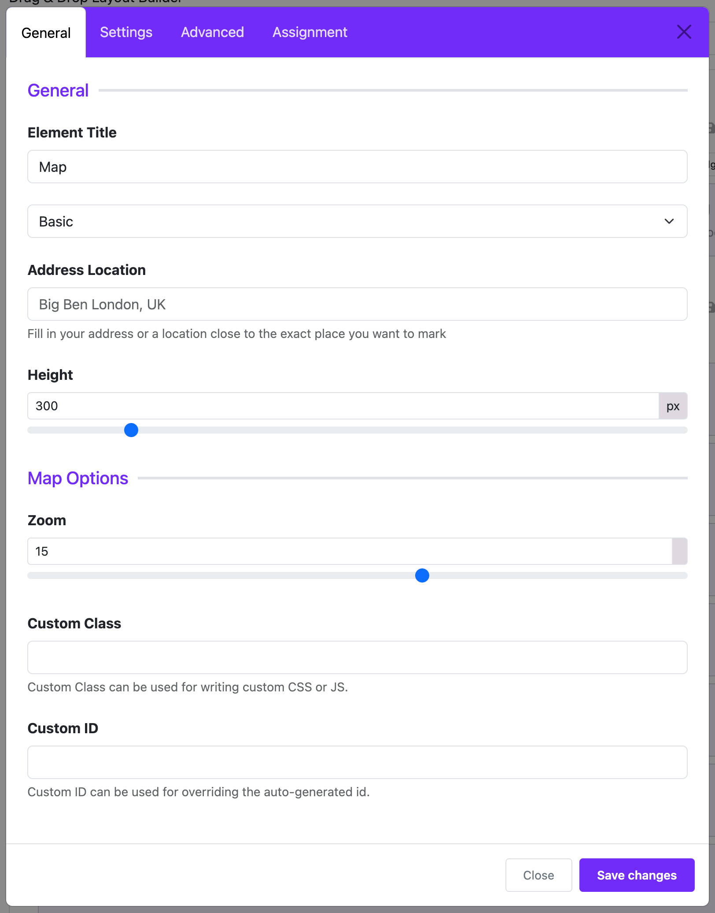

# Map

The **Map Widget** in Moon Framework allows you to embed interactive Google Maps on your Joomla website. You can show a single location or multiple markers with customizable map types and behavior.

## 📌 Key Features

- Display **a single location** (basic or advanced mode)
- Support for **multiple markers**
- Adjustable **map height**, **zoom**, and **display controls**
- Info windows (popup text) on markers
- Toggleable mouse scroll and map controllers

---

## 🛠 How to Use

### 📍 Step 1: Open the Layout Builder

1. Go to your Joomla **Administrator Panel**
2. Navigate to: `System` → `Site Template Styles` → Click on your **Astroid template**
3. Click the **“Template Options”** button
4. Open the **Layout** tab
5. Launch the **Layout Builder**

---

### 🧱 Step 2: Add the Widget
1. Open the **Astroid Layout Builder**.
2. Add a new **Widget** to your desired section.
3. Select **Map Widget** from the widget list.

---

## ⚙️ Settings Overview

### 🧩 General Settings

| Field | Description |
|-------|-------------|
| **Map Options / Multiple Maps** | Groups for organizing options. No input required. |
| **Map Type Option** (`map_option`) | Choose between `Basic` or `Advanced` mode. |
| **Location (Basic Mode)** | Input a location name (e.g., `Big Ben London, UK`). |
| **Map Coordinates (Advanced Mode)** | Input latitude and longitude (e.g., `23.755349,90.375961`). |
| **Map Type** | Choose map style: Roadmap, Satellite, Hybrid, or Terrain. |
| **Map Height** | Set map height in pixels (default: `300px`). |

---

### 🗺 Map Options (Advanced Mode Only)

| Field | Description |
|-------|-------------|
| **Info Window** | Optional HTML content displayed when a marker is clicked. |
| **Zoom Level** | From 0 (world view) to 25 (street view). Default: 15. |
| **Mouse Scroll Zoom** | Enable/disable scroll zooming on map. |
| **Show Controllers** | Show/hide zoom and navigation controls. |

---

### 📍 Multiple Locations (Advanced Mode)

| Field | Description |
|-------|-------------|
| **Enable Multi Location** | Turn on to allow multiple markers. |
| **Multi Location Items** | Add multiple entries: each with coordinates and info popup. |

---

### 📄 Assignment Settings

| Field | Description |
|-------|-------------|
| **Widget Assignment** | Choose where the map widget is displayed: All pages, No pages, or Selected menu items. |
| **Menu Assignment** | (Visible only when "Selected Pages" is chosen) Assign the widget to specific menu items. |

---

## 💡 Example Usage

- **Basic Mode**: Show your store address using a simple address like “Times Square, New York”.
- **Advanced Mode**: Add exact coordinates for precise pin placement.
- **Multiple Locations**: Show all branch offices with info popups for each.

---

## 🧭 Tips

- Use Google Maps coordinates for better accuracy.
- Customize InfoWindow content using HTML.
- Use satellite or hybrid views for more visual appeal.

---

## ✅ Requirements

- An active internet connection.
- Optionally: Google Maps API Key if your Joomla setup requires it (not configured in this widget, but may be needed globally).