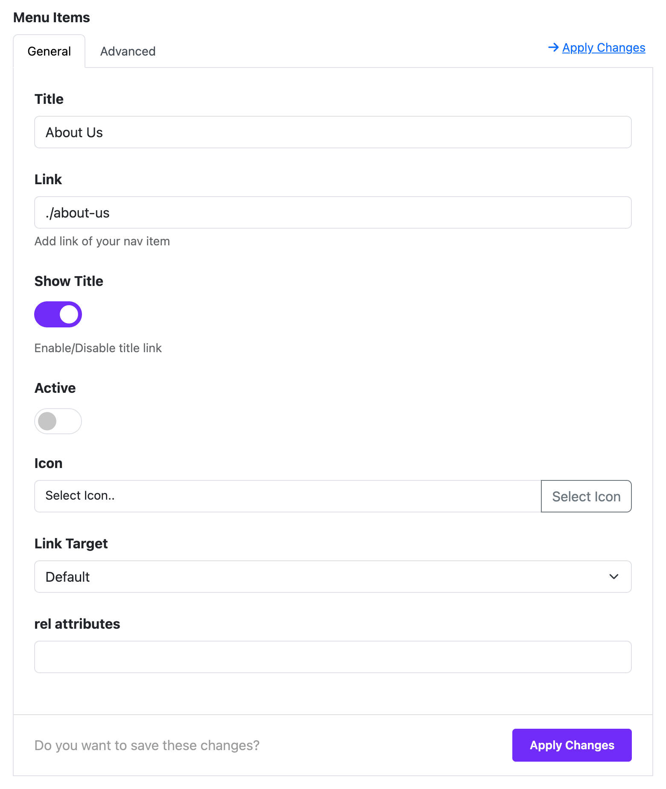

# Navigation

The **Navigation Widget** in Moon Framework allows you to create a customizable navigation menu with multiple menu items, icons, styles, and responsive layout options. This widget is suitable for creating vertical or horizontal menus in any section of your Astroid-powered Joomla website.

## 🛠 How to Use

### 📍 Step 1: Open the Layout Builder

1. Go to your Joomla **Administrator Panel**
2. Navigate to: `System` → `Site Template Styles` → Click on your **Astroid template**
3. Click the **“Template Options”** button
4. Open the **Layout** tab
5. Launch the **Layout Builder**

---

### 🧱 Step 2: Add the Widget
1. Open the **Astroid Layout Builder**.
2. Add a new **Widget** to your desired section.
3. Select **Navigation Widget** from the widget list.

---

## 🔧 General Settings

### Menu Items
You can add multiple menu items by clicking the **"Add Item"** button. Each menu item includes the following fields:

- **Title**: The display text of the menu item.
- **Link**: The URL this item points to (e.g., `https://example.com`).
- **Show Title**: Toggle the display of the title (Yes/No).
- **Active**: Mark this item as the active link.
- **Icon**: Choose an icon to display alongside the title.
- **Link Target**:
    - Default
    - New Window (`_blank`)
    - Parent Frame (`_parent`)
    - Full Body of the Window (`_top`)
- **Rel Attribute**: (Optional) Set relationship attributes like `nofollow`.

#### Dynamic Content Support
You can also integrate dynamic content sources by configuring:
- **Dynamic Group Settings**: Enable dynamic options.
- **Dynamic Content Source**: Choose the source of the content.

---

## 🎨 Style Options

### List Style (under Misc Options)
- **Navigation (default)**: Horizontal layout.
- **List**: Vertical (flex-column) layout.

### Font Style
Customize font typography for the navigation items (e.g., font size, weight, line height).

---

## 🎨 Color Options

Set different color schemes depending on the state:

- **Color**: Default state
- **Hover**: When user hovers over the item
- **Active**: When the item is active

Each state allows customization of:
- **Text Color**
- **Background Color**

---

## 📐 Spacing Options

- **Margin**: Outer spacing for each item.
- **Padding**: Inner spacing for each item.

---

## 📱 Column Options (Responsive Layout)

You can control how the navigation widget appears on different screen sizes:

- Choose screen breakpoint: `xxl`, `xl`, `lg`, `md`, `sm`, `xs`
- For each size, set a column width:
    - `1/2`, `1/3`, `1/4`, `1/5`, `1/6`
    - Or inherit from global settings

---

## ⚙️ Assignment Settings

Decide where the widget should appear:

- **On All Pages**
- **No Pages**
- **Selected Pages**: If selected, you can choose specific menu items or pages where this widget will be shown.

---

## 🧩 Category
- This widget belongs to: **Utility Widgets**

---

## 💡 Tips

- Use icons for better visual clarity.
- Combine with column settings to create responsive layouts in Grid or Flex containers.
- Leverage Dynamic Content to pull in links from articles or menus automatically.

---