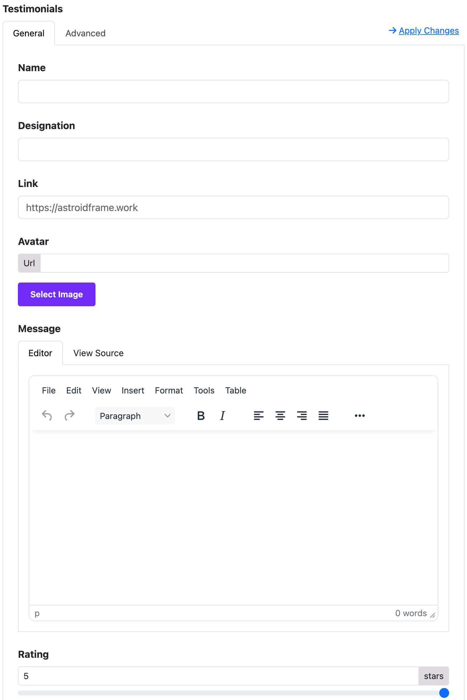

# Testimonials

The **Testimonials Widget** allows you to showcase customer feedback or user reviews in an attractive and professional format on your Joomla website using the Moon Framework.

---

## 🧩 What is the Testimonials Widget?

The **Testimonials Widget** is a content block that helps you display one or multiple testimonials, usually including:

- Customer’s name
- Their photo/avatar
- Their feedback
- Their position/company (optional)

This widget is useful for **building trust** and **enhancing credibility** on your website.

---

## 🛠️ How to Add the Testimonials Widget

1. **Login** to your Joomla admin panel.
2. Go to **Astroid Template > Template Options**.
3. Navigate to the **Layout Builder** section.
4. Click **Add Widget** at the location you want.
5. Choose **Testimonials** from the widget list.


---

## ⚙️ Widget Settings Overview

Once the widget is added, you can configure it using the available options:

### 1. **General Settings**
| Option         | Description                                                  |
|----------------|--------------------------------------------------------------|
| Title          | Optional title to display above the testimonials block.      |
| Style          | Choose from default or custom layout styles.                 |
| Alignment      | Align the text (left, center, right).                        |

---

### 2. **Add Testimonials Items**
Each testimonial has the following fields:

| Field       | Description                                                                 |
|-------------|-----------------------------------------------------------------------------|
| Name        | Name of the person giving the testimonial.                                  |
| Designation | (Optional) Job title or company name of the person.                         |
| Avatar      | Upload the person’s photo or avatar.                                        |
| Message     | The feedback or testimonial content.                                        |

➡️ To add multiple testimonials, click **“Add Item”** and fill in the fields for each one.



---

### 3. **Layout Options**
| Option         | Description                                                |
|----------------|------------------------------------------------------------|
| Layout Style   | Choose layout: list, grid, or carousel (depending on theme)|
| Columns        | Number of columns (if using grid layout)                   |
| Show Avatar    | Show or hide the person’s image.                           |
| Show Position  | Enable/disable display of position or company.             |

---

### 4. **Style Customization (Optional)**
Customize how your testimonials look:

- Background color
- Font size
- Text color
- Spacing
- Avatar shape (circle or square)

*These options may depend on your template’s available styling tools.*

---

## 💡 Tips for Better Testimonials

- Use **real names and photos** for authenticity.
- Keep messages short and sincere.
- Mix text with visuals to improve visual interest.

---

## ✅ Example Use Case

```
Name: Sarah Nguyen  
Position: Marketing Manager, ABC Co.  
Message: "This template made it incredibly easy to launch our company site. Highly recommend!"  
Avatar: [Uploaded Image]
```

---

## 🧹 How to Remove Testimonials Widget

1. In Layout Builder, hover over the widget block.
2. Click the **trash icon** to delete it.
3. Save your layout.

---

## 🔄 Saving and Publishing

After editing:

- Click **Save Layout** to keep the changes.
- Refresh your site to see testimonials live.
